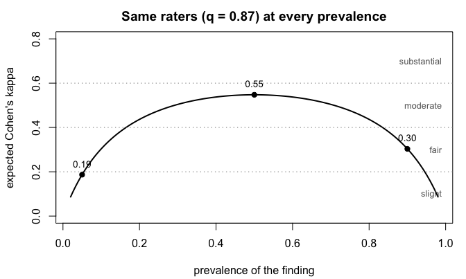
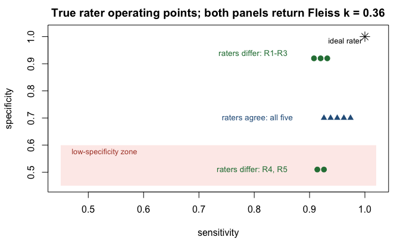
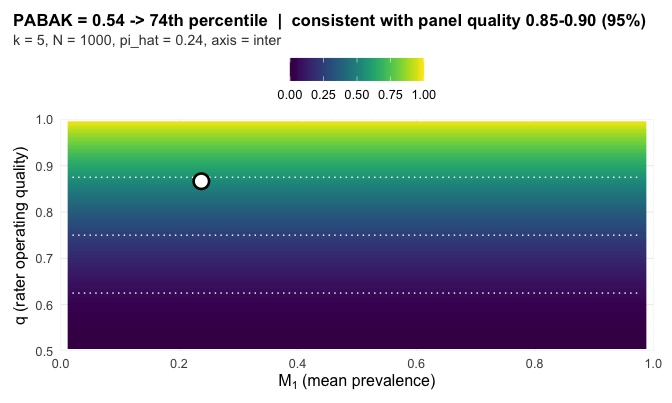

## The data: a rater panel

A **rater panel** is `k` raters who each score the same `N`
subjects on one binary question. The subjects are whatever is being
rated. The raters are whoever rates them, human or machine. Each
rater sees every subject exactly once and answers the same yes-or-no
question about it, so the study produces `N x k` binary calls and
nothing else. Chest films read for a finding, adverse events judged
preventable or not, transcripts coded for a symptom mention:
different fields, same object.

That object is the package's entire input, laid out as a matrix. One
row per subject. One column per rater. Each cell is that rater's
call on that subject: 1 (or `TRUE`, or the positive level of a
two-level factor) means present, 0 means absent.

The same shape carries two different questions.

- **Inter-rater agreement** asks whether different raters agree with
  each other. Columns are different people; this is the default and
  everything below is this case.
- **Intra-rater agreement** asks whether one rater agrees with
  herself on re-reading. Columns are one person's repeated viewings
  of the same subjects, and the call is
  `grass_report(Y, axis = "intra")`; the printed card has the same
  fields.

What the functions accept, completely:

- a `matrix` or `data.frame`, subjects in rows, raters in columns,
  at least 2 raters and one row per subject;
- rows are independent subjects. Every row must be a different
  subject, never a repetition of one (repeated-measures designs are
  addressed just below);
- cells as numeric 0/1, `logical`, or a two-level `factor`
  (character columns are rejected; convert to factor first);
- column names are optional and become rater labels on the card;
- no `NA`s: the functions stop rather than silently drop, so filter
  first with `Y <- Y[complete.cases(Y), ]` and report the exclusions
  in your Methods;
- binary outcomes only. Ordinal scales and continuous measurements
  are outside this package's calibration.

The calibration assumes every row is a new subject. Two common
clinical designs break that assumption.

- **Repetitions within a session.** A patient performs the task
  three times and the raters score every repetition. Do not stack
  the repetitions as rows: repetitions of one patient are
  correlated, the stacked matrix overstates the number of subjects,
  and the band comes out narrower than the design earns. Build one
  matrix per repetition and compare the cards, or fix one
  repetition per patient by protocol.
- **The same patients across sessions over time.** Within a session
  the rows are distinct patients, so each session is a valid panel.
  Score one card per session; the sequence of cards is the
  stability record. grassr does not pool sessions into one number
  and does not split disagreement into patient, session, and rater
  components. Those are variance-component analyses, outside this
  package's calibration.

A 0/1 matrix does not say which rows share a patient, so grassr
cannot detect either design. You enforce this part of the
contract, not an error message.

In practice you load your scores from a file. Here we simulate the
panel instead, so the truth is known and every claim below can be
checked against it: 150 subjects at 30% prevalence, three raters who
each call 87% of cases correctly.


```r
library(grassr)
set.seed(7)
truth <- rbinom(150, 1, 0.30)                  # the latent true classes
Y0 <- sapply(1:3, function(j)                  # three raters, 87% accurate
  ifelse(truth == 1, rbinom(150, 1, 0.87), rbinom(150, 1, 0.13)))
colnames(Y0) <- c("R1", "R2", "R3")
head(Y0, 8)
#>      R1 R2 R3
#> [1,]  1  0  1
#> [2,]  0  0  0
#> [3,]  0  0  1
#> [4,]  0  0  0
#> [5,]  0  0  0
#> [6,]  1  1  1
#> [7,]  0  0  0
#> [8,]  1  1  0
```

Row 6 is unanimous. Rows 1, 3, and 8 split. The question every
reliability study asks is whether these raters agree well enough to
trust the scores. The conventional answer computes one coefficient
and stamps a label on it from a fixed scale: 0.21 to 0.40 is
*fair*, 0.41 to 0.60 *moderate*, 0.61 to 0.80 *substantial*.

## The problem: the label tracks the study, not the raters

Every chance-corrected coefficient is the same fraction, written in
plain terms as

```
coefficient = (observed agreement − chance agreement) / (1 − chance agreement)
```

The catch is the chance term. It depends on how often the finding
appears in front of the raters, so the coefficient moves when
prevalence moves, with the raters unchanged. At two raters the
expected value has a closed form, and four lines of code show the
problem:


```r
q <- 0.87                       # every rater calls 87% of cases correctly
prev <- seq(0.02, 0.98, 0.005)
Pa <- q^2 + (1 - q)^2           # P(two such raters agree); prevalence-free
pip <- prev * q + (1 - prev) * (1 - q)  # observed positive rate
kappa <- (Pa - (pip^2 + (1 - pip)^2)) / (1 - (pip^2 + (1 - pip)^2))

op <- par(mar = c(4.2, 4.2, 2.4, 1))
plot(prev, kappa, type = "l", lwd = 2, ylim = c(0, 0.8),
     xlab = "prevalence of the finding", ylab = "expected Cohen's kappa",
     main = "Same raters (q = 0.87) at every prevalence")
abline(h = c(0.20, 0.40, 0.60), lty = 3, col = "grey55")
text(rep(0.99, 4), c(0.10, 0.30, 0.50, 0.70), adj = 1, col = "grey40",
     cex = 0.8, labels = c("slight", "fair", "moderate", "substantial"))
pts <- c(0.05, 0.50, 0.90)
ptk <- sapply(pts, function(p) {
  pp <- p * q + (1 - p) * (1 - q)
  (Pa - (pp^2 + (1 - pp)^2)) / (1 - (pp^2 + (1 - pp)^2))
})
points(pts, ptk, pch = 19)
text(pts, ptk + 0.05, sprintf("%.2f", ptk), cex = 0.85)
```



```r
par(op)
```

One rater panel, three published verdicts. A screening study at 5%
prevalence reports *slight* agreement, a balanced study reports
*moderate*, a high-prevalence study reports *fair*, and the raters
never changed. Rater count and sample size move the value too. The
label tracks the study design, not the people.

The three coefficients in common use split the same way on a single
dataset, because each computes the chance term differently. Fleiss'
kappa computes it from the panel's marginal positive rate, PABAK
fixes it at one half, and AC1 interpolates between the two. Same
data, three numbers, three labels.

## What grassr reports instead

grassr asks where the observed coefficient sits among the values a
panel could produce at this design. Four terms carry the whole
method.

- **Panel quality `q`** is the rate at which a rater calls a case
  correctly (sensitivity = specificity = `q` under the calibration
  model). This is the thing we actually want to know.
- The **reference surface** holds the coefficient values a
  quality-`q` panel produces at the design (prevalence, raters `k`,
  subjects `N`). It is derived from a data-generating process, not
  stipulated.
- The **percentile** is where the observed coefficient falls within
  everything the design can produce. This is the headline number.
- The **consistency band** holds the qualities `q` consistent with
  the observation (95%). Its width is the design's resolving power. A
  small study cannot produce a narrow band, and the reader sees that
  directly.

A fifth term, the spread `delta_hat`, measures how much the family's
coefficients disagree about `q`. When the spread is small against
chance, one number is a fair summary. When it is large, no single
number is honest and the card decomposes the panel rater by rater.

The whole workflow is one call on the matrix from the opening
section:


```r
grass_report(ratings = Y0)
#> GRASS Report Card
#> 
#>   sample      = 3 raters, N = 150, pi_hat = 0.36
#>   PABAK        = 0.52  ->  70th percentile | quality 0.80-0.90  <- primary
#>   AC1          = 0.55  ->  70th percentile | quality 0.80-0.90
#>   Fleiss kappa = 0.48  ->  71st percentile | quality 0.80-0.90
#>   ICC          = 0.62  ->  72nd percentile | quality 0.81-0.90  [distribution-sensitive]
#>   read: this panel agreed more tightly than 70% of what panels at this design can produce; the data are consistent with panel quality 0.80-0.90.
#>   delta       =   0 pp implied-quality spread (aligned)
#>   matched null = (k=3, N=150, q=0.85): delta_hat at the 10.1 percentile [design snapped]
#> 
#>   Notes:
#>     - N=150 clamped to nearest sim-grid N=100.
#>     - delta_hat is the implied-quality spread over the agreement family (PABAK, mean AC1, Fleiss kappa). ICC is reported on the panel but does not enter delta_hat (v0.5.0 scope: ICC's reference depends on the full subject-prevalence distribution F and does not share the (q, pi_+) sufficient statistic the agreement family does).
#>     - flag from delta_hat's percentile on the matched null (k=3, N=150, q=0.85; 50,000 draws); design snapped to nearest calibrated cell.
#> 
#>   See `summary(...)` for full panel and CI details.
#>   See `plot(...)` for a surface-position visualization.
```

Reading the card:

- **`sample`** is the study: rater count `k`, subject count `N`, and
  the observed positive rate.
- **The coefficient lines** show each observed value, its percentile,
  and its consistency band. The `read:` line restates the headline in
  plain language. There is no bootstrap qualifier and no labeled band
  between the percentile and the reader; the band width is the
  uncertainty statement.
- **`delta`** is the implied-quality spread across the agreement
  family (PABAK, mean AC1, Fleiss kappa; ICC excluded by
  construction). Each coefficient implies a panel quality, and the
  spread is judged by its percentile on a bundled null distribution
  at the matched design: **caution at the 95th percentile, divergent
  at the 99th**, with mid-p at ties. A panel just under a cut should
  be read by its printed percentile, not the flag word alone. At two
  raters the spread is `not_applicable`, because PABAK and AC1 imply
  identical quality by construction.

Every panel below is synthetic, so the truth is planted and every
claim the card makes can be checked against it. The cards print
exactly as `grass_report()` returns them.

## Case studies

### Three labels, one position

Five raters score 1,000 subjects. Every rater operates at quality
0.87 and the finding has true prevalence 0.15.


```r
gen_flat <- function(N, prev, Se, Sp, k, seed) {
  set.seed(seed)
  C <- rbinom(N, 1L, prev)
  sapply(seq_len(k), function(j)
    ifelse(C == 1L, rbinom(N, 1L, Se), rbinom(N, 1L, 1 - Sp)))
}
Y1 <- gen_flat(1000, prev = 0.15, Se = 0.87, Sp = 0.87, k = 5, seed = 61)
```

The three coefficients draw three different fixed labels from this
one panel: Fleiss' kappa 0.36 reads *fair*, PABAK 0.54 reads
*moderate*, AC1 0.64 reads *substantial*. A reader who saw only the
labels would conclude they describe three different panels.


```r
grass_report(Y1, verbose = FALSE)
#> GRASS Report Card
#> 
#>   sample      = 5 raters, N = 1000, pi_hat = 0.24
#>   PABAK        = 0.54  ->  74th percentile | quality 0.85-0.90  <- primary
#>   AC1          = 0.64  ->  74th percentile | quality 0.85-0.90
#>   Fleiss kappa = 0.36  ->  74th percentile | quality 0.85-0.90
#>   ICC          = 0.48  ->  63rd percentile | quality 0.80-0.85  [distribution-sensitive]
#>   read: this panel agreed more tightly than 74% of what panels at this design can produce; the data are consistent with panel quality 0.85-0.90.
#>   delta       =   0 pp implied-quality spread (aligned)
#>   matched null = (k=5, N=1000, q=0.85): delta_hat at the 42.2 percentile [design snapped]
#> 
#>   Notes:
#>     - Consistency band narrower than the calibrated q-grid spacing; endpoints interpolated within one grid gap.
#>     - delta_hat is the implied-quality spread over the agreement family (PABAK, mean AC1, Fleiss kappa). ICC is reported on the panel but does not enter delta_hat (v0.5.0 scope: ICC's reference depends on the full subject-prevalence distribution F and does not share the (q, pi_+) sufficient statistic the agreement family does).
#>     - flag from delta_hat's percentile on the matched null (k=5, N=1000, q=0.85; 50,000 draws); design snapped to nearest calibrated cell.
#> 
#>   See `summary(...)` for full panel and CI details.
#>   See `plot(...)` for a surface-position visualization.
```

The card gives all three one reading. Each sits at the 74th
percentile of what this design can produce, and each carries the
same band, quality 0.85 to 0.90, which contains the true 0.87. The
label disagreement was an artifact of reading three
prevalence-sensitive statistics against one fixed scale.

### Two panels the fixed bands call identical

Two five-rater panels, both at true prevalence 0.30 with 1,000
subjects, both returning Fleiss kappa 0.36. The fixed scale gives
one verdict, *fair*, for both. The panels could hardly be more
different: in the first, three raters operate near-ideally and two
have a severe specificity problem; in the second, all five raters
share one operating point.


```r
gen_logitnormal <- function(seed, k, N, Se, Sp, pi, F_sigma2 = 0.25) {
  set.seed(seed)
  p_i <- plogis(rnorm(N, qlogis(pi), sqrt(F_sigma2)))
  C   <- rbinom(N, 1L, p_i)
  Y   <- matrix(0L, N, k)
  for (j in seq_len(k)) Y[, j] <- rbinom(N, 1L, ifelse(C == 1L, Se[j], 1 - Sp[j]))
  Y
}
Y_differ <- gen_logitnormal(51L, 5L, 1000L,
                            Se = rep(0.92, 5),
                            Sp = c(0.92, 0.92, 0.92, 0.51, 0.51), pi = 0.30)
Y_agree  <- gen_logitnormal(151L, 5L, 1000L,
                            Se = rep(0.95, 5),
                            Sp = rep(0.70, 5), pi = 0.30)
```



The first panel splits across the low-specificity zone, and the card
routes to per-rater output.


```r
grass_report(Y_differ, bootstrap_B = 200, verbose = FALSE)
#> GRASS Report Card
#> 
#>   sample      = 5 raters, N = 1000, pi_hat = 0.47
#>   PABAK         = 0.36  ->  58th percentile  <- primary
#>   AC1           = 0.38  ->  60th percentile
#>   Fleiss kappa  = 0.36  ->  58th percentile
#>   ICC           = 0.46  ->  58th percentile  [distribution-sensitive]
#>   panel-agg.  = suppressed (divergent)
#>   delta       = 0.42 pp (divergent)
#>   matched null = (k=5, N=1000, q=0.85): delta_hat at the 99.5 percentile [design snapped]
#> 
#>   pairwise PABAK / surface percentile (lower / upper):
#>     R1     R2     R3     R4     R5    
#>   R1    --     84%    84%    48%    40% 
#>   R2    0.71   --     81%    45%    41% 
#>   R3    0.70   0.67   --     45%    41% 
#>   R4    0.27   0.24   0.25   --     35% 
#>   R5    0.21   0.22   0.21   0.17   --  
#> 
#>   per-rater vs panel-majority of OTHER raters (pooled-reference):
#>     R1   Se_tilde = 0.84  Sp_tilde = 0.93  (n_pos = 360, n_neg = 457, excl = 183)
#>     R2   Se_tilde = 0.85  Sp_tilde = 0.91  (n_pos = 352, n_neg = 460, excl = 188)
#>     R3   Se_tilde = 0.83  Sp_tilde = 0.92  (n_pos = 351, n_neg = 459, excl = 190)
#>     R4   Se_tilde = 0.92  Sp_tilde = 0.51  (n_pos = 327, n_neg = 581, excl = 92)
#>     R5   Se_tilde = 0.88  Sp_tilde = 0.50  (n_pos = 330, n_neg = 579, excl = 91)
#> 
#>   per-rater (latent-class fit; alongside pairwise):
#>     R1   Se = 0.93  (0.89, 0.96)   Sp = 0.93  (0.92, 0.96)
#>     R2   Se = 0.92  (0.89, 0.95)   Sp = 0.91  (0.88, 0.93)
#>     R3   Se = 0.89  (0.86, 0.93)   Sp = 0.91  (0.88, 0.94)
#>     R4   Se = 0.93  (0.90, 0.96)   Sp = 0.51  (0.47, 0.55)
#>     R5   Se = 0.89  (0.86, 0.92)   Sp = 0.50  (0.46, 0.54)
#> 
#>   Notes:
#>     - delta_hat is the implied-quality spread over the agreement family (PABAK, mean AC1, Fleiss kappa). ICC is reported on the panel but does not enter delta_hat (v0.5.0 scope: ICC's reference depends on the full subject-prevalence distribution F and does not share the (q, pi_+) sufficient statistic the agreement family does).
#>     - flag from delta_hat's percentile on the matched null (k=5, N=1000, q=0.85; 50,000 draws); design snapped to nearest calibrated cell.
#> 
#>   See `summary(...)` for full panel and CI details.
#>   See `plot(...)` for a surface-position visualization.
```

The observed coefficients are unremarkable. The implied-quality
spread is not: 0.42 quality points, at the 99.5th percentile of what
chance produces at this design, so the card declines to average the
panel into one number. The latent-class fit names the structure, R4
and R5 near specificity 0.51 against 0.91 to 0.93 for the rest. This
panel does not need more raters or more subjects. It needs R4 and R5
retrained on the negative-call criterion.

The second panel is the honest limit of any internal diagnostic.


```r
grass_report(Y_agree, verbose = FALSE)
#> GRASS Report Card
#> 
#>   sample      = 5 raters, N = 1000, pi_hat = 0.49
#>   PABAK        = 0.36  ->  56th percentile | quality 0.75-0.85  <- primary
#>   AC1          = 0.36  ->  56th percentile | quality 0.75-0.85
#>   Fleiss kappa = 0.36  ->  56th percentile | quality 0.75-0.85
#>   ICC          = 0.47  ->  61st percentile | quality 0.76-0.85  [distribution-sensitive]
#>   read: this panel agreed more tightly than 56% of what panels at this design can produce; the data are consistent with panel quality 0.75-0.85.
#>   delta       =   0 pp implied-quality spread (aligned)
#>   matched null = (k=5, N=1000, q=0.75): delta_hat at the 35.6 percentile [design snapped]
#> 
#>   Notes:
#>     - delta_hat is the implied-quality spread over the agreement family (PABAK, mean AC1, Fleiss kappa). ICC is reported on the panel but does not enter delta_hat (v0.5.0 scope: ICC's reference depends on the full subject-prevalence distribution F and does not share the (q, pi_+) sufficient statistic the agreement family does).
#>     - flag from delta_hat's percentile on the matched null (k=5, N=1000, q=0.75; 50,000 draws); design snapped to nearest calibrated cell.
#> 
#>   See `summary(...)` for full panel and CI details.
#>   See `plot(...)` for a surface-position visualization.
```

Nothing in the card objects, yet the panel calls about half its
subjects positive against a true prevalence of 0.30. Every rater
shares the same specificity deficit, so the shared error shifts all
marginals in unison and no internal comparison can see it. Agreement
diagnostics detect raters who disagree with each other, not a panel
that is wrong together. Only an external reference standard reaches
the second failure; the card's job is to make the first kind visible
instead of averaging it away.

### A divergent panel and the per-rater route

The flag also catches asymmetry that cancels at the panel level.
Three raters lean toward over-calling (sensitivity 0.95, specificity
0.75); two lean the other way (0.75, 0.95). Each coefficient returns
roughly the same observed value, yet the qualities they imply split.


```r
Y_div <- gen_logitnormal(6L, 5L, 1000L,
                         Se = c(0.95, 0.75, 0.95, 0.75, 0.95),
                         Sp = c(0.75, 0.95, 0.75, 0.95, 0.75), pi = 0.50)
card_div <- grass_report(ratings = Y_div, bootstrap_B = 200)
card_div
#> GRASS Report Card
#> 
#>   sample      = 5 raters, N = 1000, pi_hat = 0.50
#>   PABAK         = 0.49  ->  67th percentile  <- primary
#>   AC1           = 0.49  ->  69th percentile
#>   Fleiss kappa  = 0.49  ->  67th percentile
#>   ICC           = 0.62  ->  65th percentile  [distribution-sensitive]
#>   panel-agg.  = suppressed (divergent)
#>   delta       = 0.25 pp (divergent)
#>   matched null = (k=5, N=1000, q=0.85): delta_hat at the 99.5 percentile [design snapped]
#> 
#>   pairwise PABAK / surface percentile (lower / upper):
#>     R1     R2     R3     R4     R5    
#>   R1    --     65%    71%    67%    74% 
#>   R2    0.47   --     62%    73%    64% 
#>   R3    0.51   0.41   --     62%    73% 
#>   R4    0.48   0.52   0.42   --     70% 
#>   R5    0.55   0.46   0.54   0.50   --  
#> 
#>   per-rater vs panel-majority of OTHER raters (pooled-reference):
#>     R1   Se_tilde = 0.94  Sp_tilde = 0.77  (n_pos = 434, n_neg = 471, excl = 95)
#>     R2   Se_tilde = 0.71  Sp_tilde = 0.95  (n_pos = 466, n_neg = 439, excl = 95)
#>     R3   Se_tilde = 0.95  Sp_tilde = 0.71  (n_pos = 433, n_neg = 485, excl = 82)
#>     R4   Se_tilde = 0.74  Sp_tilde = 0.95  (n_pos = 468, n_neg = 441, excl = 91)
#>     R5   Se_tilde = 0.96  Sp_tilde = 0.78  (n_pos = 428, n_neg = 476, excl = 96)
#> 
#>   per-rater (latent-class fit; alongside pairwise):
#>     R1   Se = 0.95  (0.21, 0.97)   Sp = 0.78  (0.05, 0.82)
#>     R2   Se = 0.73  (0.04, 0.78)   Sp = 0.95  (0.28, 0.97)
#>     R3   Se = 0.96  (0.26, 0.98)   Sp = 0.72  (0.04, 0.75)
#>     R4   Se = 0.75  (0.05, 0.79)   Sp = 0.95  (0.25, 0.97)
#>     R5   Se = 0.96  (0.21, 0.98)   Sp = 0.78  (0.04, 0.82)
#> 
#>   Notes:
#>     - delta_hat is the implied-quality spread over the agreement family (PABAK, mean AC1, Fleiss kappa). ICC is reported on the panel but does not enter delta_hat (v0.5.0 scope: ICC's reference depends on the full subject-prevalence distribution F and does not share the (q, pi_+) sufficient statistic the agreement family does).
#>     - flag from delta_hat's percentile on the matched null (k=5, N=1000, q=0.85; 50,000 draws); design snapped to nearest calibrated cell.
#> 
#>   See `summary(...)` for full panel and CI details.
#>   See `plot(...)` for a surface-position visualization.
```

Three things change in the printed output. The panel-aggregate
summary is marked `suppressed (divergent)`. The pairwise PABAK matrix
and the per-rater pooled-reference table appear, exposing the
structure pair by pair and rater by rater. And the latent-class
table appears alongside, pinning R1, R3, R5 near (0.95, 0.75) and
R2, R4 near (0.75, 0.95); its bootstrap intervals are wide near
balanced prevalence because the resamples visit both the correct
mode and its label-switched mirror.

Under the divergent flag the recommended primary deliverable is
`pairwise_agreement()`:


```r
pw <- pairwise_agreement(Y_div)
pw
#> GRASS Pairwise Reliability
#> 
#>   sample      = 5 raters, N = 1000, pi_hat = 0.50, tau2_hat = 0.122, axis = inter
#> 
#>   Pairwise PABAK (lower triangle = PABAK_ij; upper triangle = surface percentile):
#> 
#>    R1     R2     R3     R4     R5    
#> R1     --   65%    71%    67%    74% 
#> R2   0.47     --   62%    73%    64% 
#> R3   0.51   0.41     --   62%    73% 
#> R4   0.48   0.52   0.42     --   70% 
#> R5   0.55   0.46   0.54   0.50     --
#> 
#>   Per-rater behavior against pooled panel-majority:
#> 
#>  rater Se_tilde Sp_tilde n_pos n_neg n_excl
#>     R1     0.94     0.77   434   471     95
#>     R2     0.71     0.95   466   439     95
#>     R3     0.95     0.71   433   485     82
#>     R4     0.74     0.95   468   441     91
#>     R5     0.96     0.78   428   476     96
#>   (Se_tilde, Sp_tilde are calls vs panel-majority of OTHER raters,
#>    not against external truth. n_excl: subjects with tied majority,
#>    excluded from the per-rater pool.)
```

Read the per-rater table first. The reference is the observable
panel majority rather than a latent class, so label-switching is
moot: an over-caller shows high `Se_tilde` and lower `Sp_tilde`, an
under-caller the mirror. In the matrix, the lower triangle holds the
pairwise agreements and the upper triangle their percentiles at each
pair's own marginal. The same PABAK value can land at different
percentiles across pairs because each pair sees a different positive
rate; the flag is exposing exactly the structure a panel average
would have hidden.

### Two raters

The headline call works at k = 2 with no signature change.


```r
set.seed(42)
N <- 200
truth <- rbinom(N, 1, 0.30)
Y_k2 <- cbind(
  ifelse(truth == 1, rbinom(N, 1, 0.85), rbinom(N, 1, 0.15)),
  ifelse(truth == 1, rbinom(N, 1, 0.85), rbinom(N, 1, 0.15))
)

grass_report(ratings = Y_k2)
#> GRASS Report Card
#> 
#>   sample      = 2 raters, N = 200, pi_hat = 0.39
#>   PABAK  = 0.50  ->  69th percentile | quality 0.80-0.90  <- primary
#>   AC1    = 0.52  ->  69th percentile | quality 0.80-0.90
#>   read: this panel agreed more tightly than 69% of what panels at this design can produce; the data are consistent with panel quality 0.80-0.90.
#>   delta       =   0 pp implied-quality spread (not_applicable)
#>   matched null = n/a at k = 2 (coefficients cannot disagree; see pairwise/bounds path)
#> 
#>   Notes:
#>     - delta_hat is not applicable at k = 2: the two-coefficient agreement family (PABAK, AC1) implies identical panel quality by construction, so cross-coefficient discordance cannot be observed. Use the k = 2 identifiable bounds and pairwise path for asymmetry assessment.
#> 
#>   See `summary(...)` for full panel and CI details.
#>   See `plot(...)` for a surface-position visualization.
```

With two raters the agreement family reduces to PABAK and AC1, which
imply identical quality by construction, so `delta_hat` reports
`not_applicable` rather than a flag. Per-rater sensitivity and
specificity are not point-identified from a two-rater matrix, so the
latent-class fit returns Hui-Walter bounds instead of point
estimates:


```r
latent_class_fit(ratings = Y_k2, B = 200)
#> grass latent-class fit
#>   method        : hui_walter
#>   raters (k)    : 2
#>   bootstrap B   : 200
#>   per-rater
#>     R1    Se in [0.395, 1.000]   Sp in [0.605, 1.000]   (bounds)
#>     R2    Se in [0.385, 1.000]   Sp in [0.615, 1.000]   (bounds)
#> 
#>   Note: at k = 2, per-rater Se/Sp are not point-identified
#>         without external information. The intervals are
#>         Hui-Walter (1980) inequality bounds, not point
#>         estimates with sampling uncertainty.
```

The bounds carry the same meaning as the k >= 3 point estimates, an
honest statement of what the data say about each rater. A study that
needs per-rater points should add a third rater.

## Layered access

Every field beneath the printed card is available on demand. The
examples reuse the aligned case.


```r
card1 <- grass_report(Y1, verbose = FALSE)
summary(card1)
#> GRASS Report Card -- summary
#> 
#>   sample       : k = 5 raters, N = 1000, pi_hat = 0.237, axis = inter
#>   tau2_hat     : 0.065
#> 
#>   primary coefficient
#>     name         : pabak
#>     observed     : 0.537
#>     percentile   : 73.86 pp (pooled; position in the design's achievable range)
#>     q_hat        : 0.866
#>     band         : consistent with panel quality 0.85-0.90 (95%)
#>     basis        : pooled-achievable-range
#> 
#>   delta (cross-coefficient asymmetry)
#>     implied-q spread (pp) : 0.00
#>     flag             : aligned
#>     delta percentile : 42.2 pctile on matched null (k=5, N=1000, q=0.85)
#> 
#>   panel (full table)
#>     pabak           observed = 0.537  q_hat = 0.866  pct = 73.86 pp  quality 0.85-0.90              ref = closed-form
#>     mean_ac1        observed = 0.637  q_hat = 0.866  pct = 73.86 pp  quality 0.85-0.90              ref = closed-form
#>     fleiss_kappa    observed = 0.361  q_hat = 0.866  pct = 73.86 pp  quality 0.85-0.90              ref = closed-form
#>     icc             observed = 0.484  q_hat = 0.822  pct = 62.50 pp  quality 0.80-0.85              ref = fitted-icc
#> 
#>   notes
#>     - Consistency band narrower than the calibrated q-grid spacing; endpoints interpolated within one grid gap.
#>     - Fitted-ICC F_key picked via glmer: mu_hat=-1.775, tau2_hat=3.089 -> F_key tau2=4.0000, mu=-1.386.
#>     - Fitted-ICC reference (GLMM-gap corrected) at F_key=LN_mu=-1.386_tau2=4.0000, k=5, N=1000 (family=logit_normal, M1=0.300).
#>     - delta_hat is the implied-quality spread over the agreement family (PABAK, mean AC1, Fleiss kappa). ICC is reported on the panel but does not enter delta_hat (v0.5.0 scope: ICC's reference depends on the full subject-prevalence distribution F and does not share the (q, pi_+) sufficient statistic the agreement family does).
#>     - flag from delta_hat's percentile on the matched null (k=5, N=1000, q=0.85; 50,000 draws); design snapped to nearest calibrated cell.
#> 
#>   grass version : 0.7.2
#>   timestamp     : 2026-07-07 09:57:22
```

`summary()` is the audit view: the full panel with percentiles and
bands, every caveat from the surface lookup, the package version,
the timestamp.


```r
head(as.data.frame(card1), 5)
#>    coefficient observed_value surface_percentile band_lo band_hi band_open_low
#> 1        pabak      0.5372000           73.86364 0.85125 0.89875         FALSE
#> 2     mean_ac1      0.6372062           73.86364 0.85125 0.89875         FALSE
#> 3 fleiss_kappa      0.3609191           73.86364 0.85125 0.89875         FALSE
#> 4          icc      0.4842582           62.50000 0.80125 0.84875         FALSE
#>   band_open_high     q_hat    se_q_hat clamped reference_used in_delta_hat
#> 1          FALSE 0.8664693 0.005014575   FALSE    closed-form         TRUE
#> 2          FALSE 0.8664471 0.005014821   FALSE    closed-form         TRUE
#> 3          FALSE 0.8664693 0.005014575   FALSE    closed-form         TRUE
#> 4          FALSE 0.8217253 0.002468171   FALSE     fitted-icc        FALSE
#>   is_primary  delta_hat delta_percentile delta_flag matched_null_k
#> 1       TRUE 0.00221665         42.21665    aligned              5
#> 2      FALSE 0.00221665         42.21665    aligned              5
#> 3      FALSE 0.00221665         42.21665    aligned              5
#> 4      FALSE 0.00221665         42.21665    aligned              5
#>   matched_null_N matched_null_q
#> 1           1000           0.85
#> 2           1000           0.85
#> 3           1000           0.85
#> 4           1000           0.85
```

`as.data.frame()` is the tidy view, one row per coefficient, for
binding many studies' cards into one table.


```r
plot(card1)
```

<div class="figure">

<p class="caption">plot of chunk plot-surface-card</p>
</div>

The default `plot()` view places the panel on the expected-value
surface at its design, with the observation pinned. Other views
(`type = "thermometer"` for the `delta_hat` gauge, `"panel"`,
`"intervals"`, `"per_rater"`, `"diagnostic"`) are documented in
`?plot.grass_card`.

## Building blocks

Three of the internals `grass_report()` calls are exported.


```r
position_on_surface(ratings = Y1, metric = "pabak")
#> grass surface-position report (sweep convention, v0.7.1)
#>   metric               : pabak
#>   observed value       : 0.537
#>   design (pi_hat,k,N)  : (0.237, 5, 1000)
#>   implied quality q_hat: 0.866 +/- 0.005
#>   pooled percentile    : 73.9 (of the design's achievable range)
#>   consistency band     : consistent with panel quality 0.85-0.90 (95%)
#>   sampling method      : empirical
#>   notes                :
#>     - Consistency band narrower than the calibrated q-grid spacing; endpoints interpolated within one grid gap.
```

`position_on_surface()` does the lookup for one coefficient and
returns the percentile, the band, the implied quality, and the full
sweep profile.


```r
check_asymmetry(ratings = Y1)
#> GRASS panel asymmetry diagnostic
#> 
#>   delta_hat = 0.0 pp  (spread of the implied panel qualities)
#>   flag      = aligned  (42.2 percentile of matched null: k=5, N=1000, q=0.85)
#> 
#>   panel:
#>     coefficient        observed   implied q   pooled pctile   in delta_hat
#>     pabak              0.54       0.866       73.9            yes
#>     mean_ac1           0.64       0.866       73.9            yes
#>     fleiss_kappa       0.36       0.866       73.9            yes
#>     icc                0.48       0.822       62.5            no [distribution-sensitive]
#> 
#>   Surface caveats:
#>     - Consistency band narrower than the calibrated q-grid spacing; endpoints interpolated within one grid gap.
#>     - Fitted-ICC F_key picked via glmer: mu_hat=-1.775, tau2_hat=3.089 -> F_key tau2=4.0000, mu=-1.386.
#>     - Fitted-ICC reference (GLMM-gap corrected) at F_key=LN_mu=-1.386_tau2=4.0000, k=5, N=1000 (family=logit_normal, M1=0.300).
#>     - delta_hat is the implied-quality spread over the agreement family (PABAK, mean AC1, Fleiss kappa). ICC is reported on the panel but does not enter delta_hat (v0.5.0 scope: ICC's reference depends on the full subject-prevalence distribution F and does not share the (q, pi_+) sufficient statistic the agreement family does).
#>     - flag from delta_hat's percentile on the matched null (k=5, N=1000, q=0.85; 50,000 draws); design snapped to nearest calibrated cell.
```

`check_asymmetry()` returns the spread and its flag without per-rater
detail.


```r
latent_class_fit(ratings = Y_div, B = 200)
#> grass latent-class fit
#>   method        : dawid_skene_em
#>   raters (k)    : 5
#>   bootstrap B   : 200
#>   converged     : TRUE
#>   iterations    : 10
#>   prevalence_hat: 0.475
#>   log-likelihood: -2504.371
#>   per-rater
#>     R1    Se = 0.950  (0.227, 0.968)   Sp = 0.783  (0.048, 0.818)
#>     R2    Se = 0.729  (0.044, 0.767)   Sp = 0.953  (0.267, 0.972)
#>     R3    Se = 0.956  (0.282, 0.977)   Sp = 0.718  (0.047, 0.751)
#>     R4    Se = 0.750  (0.048, 0.785)   Sp = 0.949  (0.252, 0.968)
#>     R5    Se = 0.962  (0.211, 0.981)   Sp = 0.781  (0.035, 0.811)
```

`latent_class_fit()` produces the per-rater table directly.

For prospective design, before any data exist, `plot_surface()` draws
a coefficient's expected-value surface at a planned design and can
pin a hypothetical observed value; see `?plot_surface`.

## Reference resolution and the clamp guard

`delta_hat` inverts each coefficient to an implied panel quality. If
an observed value falls outside the achievable range of its reference
surface at the study's design, the inversion clamps to the boundary
and flags `clamped = TRUE`, and `grass_report()` excludes clamped
coefficients from `delta_hat` whenever at least two unclamped ones
remain. Otherwise a single boundary-clamped coefficient could inflate
the spread and fire a false divergent flag.

Clamping is the exception, and the example below does not clamp. When
the exact design is not a calibrated grid point, the reference
resolves to the nearest calibrated cell and the resolution is
disclosed in the `Notes`:


```r
Y_edge <- gen_logitnormal(5L, 5L, 1000L,
                          Se = rep(0.85, 5), Sp = rep(0.85, 5), pi = 0.08)
card_edge <- grass_report(Y_edge, bootstrap_B = 50)
card_edge$panel[, c("coefficient", "surface_percentile",
                    "clamped", "reference_used")]
#>    coefficient surface_percentile clamped reference_used
#> 1        pabak           67.75846   FALSE    closed-form
#> 2     mean_ac1           67.67121   FALSE    closed-form
#> 3 fleiss_kappa           67.78692   FALSE    closed-form
#> 4          icc           51.13636   FALSE     fitted-icc
```

When a clamp does occur the card surfaces it twice, in the `Notes`
and in the `panel` data frame's `clamped` and `reference_used`
columns. The trade-off is deliberate: a coefficient with no
calibrated reference at the user's design contributes nothing, and
in exchange a fired flag reflects genuine disagreement rather than a
boundary artifact.

## The machinery

The sections above are everything a practitioner needs. This section
records the definitions and calibration facts behind them; the
accompanying paper carries the derivations and the full calibration
appendices.

**Notation.** `Y` is the N x k binary rating matrix. `pi_hat` is the
observed marginal positive rate. `Se_j` and `Sp_j` are per-rater
sensitivity and specificity inferred from the matrix, not against
external truth. `q` is diagonal rater quality (`Se = Sp = q` for
every rater under the calibration case). `q_hat` is the implied
panel quality recovered from an observed coefficient. `delta_hat` is
the spread of implied qualities, in quality percentage points, over
PABAK, mean AC1, and Fleiss kappa.

**Recovering `q_hat`.** PABAK has an algebraic inverse,
`q_hat = (1 + sqrt(PABAK)) / 2`. Fleiss kappa, AC1, Krippendorff
alpha, and ICC invert by a 501-point grid lookup with linear
interpolation. Out-of-range observations clamp to the boundary with
a flag (previous section).

**ICC and the subject-prevalence distribution.** The agreement
family's expectations depend only on the panel marginal and the
rater quality. ICC depends additionally on the full distribution of
subject-level positive probabilities: two studies can share a 30%
positive rate and differ on whether it comes from obvious positives
or borderline cases. The bundled reference covers a 48-point
logit-normal grid plus four discrete-mixture profiles; a panel whose
true distribution sits elsewhere carries a mismatch cost the
agreement family does not. That is why ICC carries its
`[distribution-sensitive]` marker and stays out of `delta_hat`.
Variant selection (ICC(1,1), ICC(2,1), ICC(3,1)) follows the Koo and
Li (2016) decision tree through the `metric` argument.

**The matched-null flag convention.** The null distribution of
`delta_hat` moves with panel quality and design, and at small N it
includes a point mass at zero, so no fixed cut in quality points
works everywhere. The package reads the observed spread's percentile
on a bundled null at the matched `(k, N, q_hat)` cell, exactly how
every coefficient on the card is already read. The nulls are
generated through the production pipeline itself, pooled over
prevalence: 440 cells at 50,000 draws each, with the 385 cells at
k >= 3 shipped (the flag is `not_applicable` at k = 2). Monte Carlo
error on a reported percentile stays under a quarter of a percentile
point at the shipped draw counts, and cells with unstable extreme
tails carry a transparency flag in the bundled object. The card
prints the matched cell, its draw count, and any design snap.

**Pairwise PABAK and pooled-reference identifiability.** PABAK is
the pairwise coefficient because under symmetric raters its
expectation reduces to `(2q - 1)^2`, a function of quality alone;
every rater pair has its own observed marginal, and Cohen's kappa at
the pair level is prevalence-attenuated (the kappa paradox of Byrt,
Bishop, and Carlin, 1993). The pooled-reference estimates read each
rater against the observable panel majority, so they are label-flip
clean whenever the majority tracks the truth direction; under a
panel whose minority is right, they read backwards. A 54-cell Monte
Carlo validation recovers each rater's true bias direction in 85.8%
of in-majority draws overall, with a per-cell median of 96.1%.
Recovery exceeds 95% at the designs where the divergent flag is the
intended deliverable (k of 5 or more at asymmetry 0.2 and above);
small panels at mild asymmetry (k = 3, A = 0.1) are the structural
floor. The package reports the per-rater pool size alongside each
estimate.

**Where the rest lives.** The accompanying paper carries the
reference-surface construction, the closed-form derivations, the
calibration grids (44,616 surface cells; 22-million-draw null and
power programs), the flag's operating characteristics, and two
published-panel reanalyses. The three case studies above are the
paper's worked examples, regenerated from the same seeds; the
quick-start and two-rater demonstration panels are this vignette's
own.

## Extending the calibration

Every number above is read from a simulated reference, and the
reference is only as fine as the compute that built it. The bundled
calibration holds 44,616 surface cells and 385 `delta_hat` null
cells, built from 133 million simulated panels. Its bounds are
compute limits, not method limits. Designs between grid
points snap to the nearest calibrated cell. The ICC reference covers
52 subject-prevalence profiles. The `delta_hat` null pools five
calibration prevalences, and 21 of its 385 cells flag unstable
extreme tails. Denser grids, a wider profile compendium, a
prevalence-stratified null, and deeper draws would each tighten the
readings, and each needs replication rather than new theory.

The package includes the tools to close these gaps. The bundled
manifest lists every open calibration block. Each block is one
seeded simulation cell, small enough to run on any machine with
grassr installed:


```r
manifest <- grass_calibration_manifest()
table(manifest$program)
#> 
#>   lattice_k prev_strata  tail_topup 
#>         220        1925          21
```

`tail_topup` deepens the 21 flagged null cells, `prev_strata`
rebuilds the `delta_hat` null with full draws in every prevalence
stratum, and `lattice_k` adds rater counts between the shipped grid
points. To see what a time budget buys on your machine, ask for a
plan. Block selection is randomized so uncoordinated contributors
rarely collide; we pin the selection here so the vignette
reproduces:


```r
set.seed(7)
plan <- grass_contribute(dir = tempdir(), hours = 5, dry_run = TRUE)
plan[, c("block_id", "program", "k", "N", "q", "prev", "draws")]
#>   block_id     program  k   N    q prev draws
#> 1      342 prev_strata  5  20 0.97 0.05 50000
#> 2     1030 prev_strata  8 200 0.75 0.80 50000
#> 3     1427 prev_strata 15  20 0.75 0.05 50000
```

The same call without `dry_run = TRUE` runs the selected blocks from
their declared seeds and writes a submission bundle to `dir`: one
result file per block plus a manifest with checksums and session
information. `grass_verify_contribution()` checks the bundle before
you send it. Submission is a pull request against the
`calibration-contrib` branch of the source repository
(https://github.com/defense031/grassr). The maintainers verify a
submission by re-executing its seeds, which reproduce bit for bit at
the same package version, and merged cells ship in the next release.
Duplicate runs of a block are not wasted, they cross-verify. For a
large budget, claim a block range through a repository issue first;
the full protocol is in the CONTRIBUTING file. The bundled
surfaces were themselves computed on two machines and merged by
cell. The wider simulation programs (the reference surfaces and
the ICC profile compendium) are in the repository under
`simulation/` for contributors who want more than the packaged
blocks.

## References

- Semmel, A. & Gidaro, R. (2026). *A context-conditioned reporting
  convention for rater reliability on binary outcomes.* (Working
  paper.) The package is the computational companion to this work.
- Byrt, T., Bishop, J. & Carlin, J. B. (1993). Bias, prevalence and
  kappa. *Journal of Clinical Epidemiology* 46(5), 423-429.
- Cohen, J. (1960). A coefficient of agreement for nominal scales.
  *Educational and Psychological Measurement* 20(1), 37-46.
- Dawid, A. P. & Skene, A. M. (1979). Maximum likelihood estimation
  of observer error-rates using the EM algorithm. *Applied
  Statistics* 28(1), 20-28.
- Fleiss, J. L. (1971). Measuring nominal scale agreement among many
  raters. *Psychological Bulletin* 76(5), 378-382.
- Gwet, K. L. (2008). Computing inter-rater reliability and its
  variance in the presence of high agreement. *British Journal of
  Mathematical and Statistical Psychology* 61(1), 29-48.
- Hui, S. L. & Walter, S. D. (1980). Estimating the error rates of
  diagnostic tests. *Biometrics* 36(1), 167-171.
- Koo, T. K. & Li, M. Y. (2016). A guideline of selecting and
  reporting intraclass correlation coefficients for reliability
  research. *Journal of Chiropractic Medicine* 15(2), 155-163.
