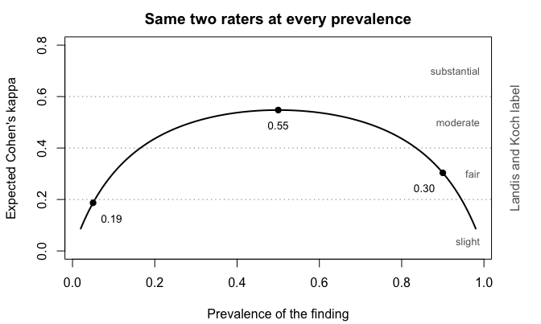
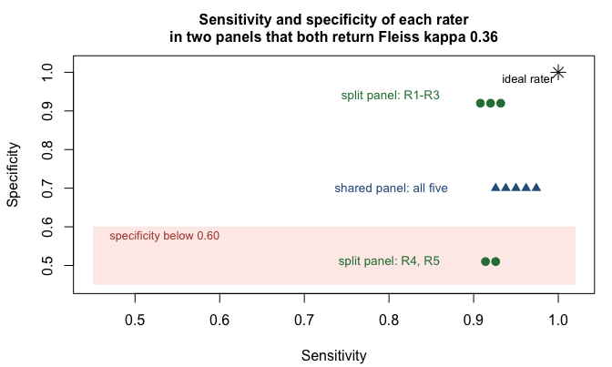
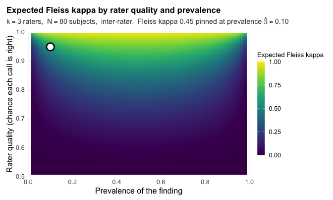
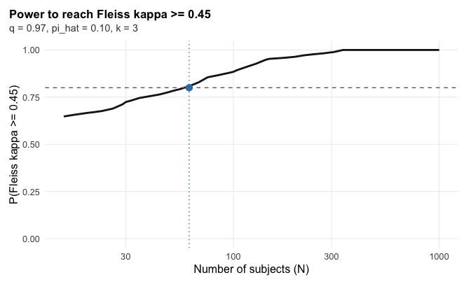
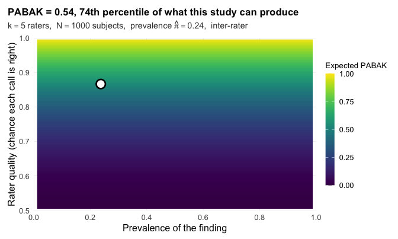

## Introduction: the prevalence trap

In a study protocol where a rater panel of `k` members evaluates `N`
subjects on a binary outcome, the resulting `N x k` response matrix is
traditionally assessed against fixed benchmarks such as the Landis and
Koch (1977) kappa scale. However, these classical metrics are
vulnerable to prevalence skew, rater count, and sample size, and can
label identical rater performance as either *slight* or *substantial*
purely because of the base rate. grassr (Guide for Rater Agreement
under Structural Skew) resolves this prevalence trap by simulating
panels within your study's specific context, translating raw
coefficients into an empirical Report Card that reports a percentile
for each coefficient, a consistency band on rater quality, and a flag
when the coefficients disagree.

For two raters fixed at quality 0.87, meaning each calls 87% of cases
correctly, the expected Cohen's kappa crosses three Landis and Koch
bands as prevalence runs from 2% to 98%.

<div class="figure">

<p class="caption">One panel of raters, three published verdicts.</p>
</div>

A screening study at 5% prevalence reports *slight*, a balanced study
reports *moderate*, a high-prevalence study reports *fair*, and the
raters never changed.

## Quick start: the GRASS Report Card

The input is one matrix or data frame, subjects in rows and raters in
columns, with at least two raters. Cells are numeric 0/1, `logical`,
or a two-level `factor` or character column, where 1, `TRUE`, or the
positive level means present. For a factor or character column the
level named yes, true, positive, present, or case, in any letter case,
is taken as positive; any other pair of labels is refused with a
message asking for a 0/1 recode, so an outcome is never inverted
erroneously. Drop identifier columns before the call. Column names, if
given, become rater labels on the card. Outcomes must be binary and
complete, since the functions stop on `NA` rather than dropping rows,
so remove incomplete rows first with `Y <- Y[complete.cases(Y), ]` and
report the exclusions.

The examples use simulated panels so that the true classes are known
and each reading can be checked against them. This first simulated
panel has 150 subjects at 30% prevalence and three raters who each
call 87% of cases correctly.


```r
library(grassr)
set.seed(7)
truth <- rbinom(150, 1, 0.30)                  # the latent true classes
Y0 <- sapply(1:3, function(j)                  # three raters, 87% accurate
  ifelse(truth == 1, rbinom(150, 1, 0.87), rbinom(150, 1, 0.13)))
colnames(Y0) <- c("R1", "R2", "R3")
head(Y0, 8)
#>      R1 R2 R3
#> [1,]  1  0  1
#> [2,]  0  0  0
#> [3,]  0  0  1
#> [4,]  0  0  0
#> [5,]  0  0  0
#> [6,]  1  1  1
#> [7,]  0  0  0
#> [8,]  1  1  0
```

Row 6 is unanimously positive, rows 2, 4, 5, and 7 unanimously
negative, and rows 1, 3, and 8 split. One call produces the card.
Use `print()` and `plot()` for the card and its diagnostics. The
`bootstrap_B` argument matters only when the panel flags divergent,
and `verbose` defaults to `FALSE`.


```r
grass_report(ratings = Y0)
#> GRASS Report Card
#> 
#>   sample      = 3 raters, N = 150, pi_hat = 0.36
#>   PABAK        = 0.52  ->  70th percentile | quality 0.80-0.90  <- primary
#>   AC1          = 0.55  ->  70th percentile | quality 0.80-0.90
#>   Fleiss kappa = 0.48  ->  71st percentile | quality 0.80-0.90
#>   ICC          = 0.62  ->  72nd percentile | quality 0.81-0.90  [distribution-sensitive]
#>   read: this panel's agreement exceeds 70% of what panels in this study
#>   context can produce; the data are consistent with panel quality 0.80-0.90.
#>   delta       = 0.00 pp implied-quality spread (aligned)
#>   matched null = (k=3, N=150, q=0.86): delta_hat sits at percentile 11.6 of
#>   the null
#> 
#>   Notes:
#>     - ICC reference only: N=150 uses the nearest calibrated N=100. The
#>       agreement-family surfaces and the delta_hat null interpolate at N=150.
#> 
#>   See `summary(...)` for full panel and CI details.
#>   See `plot(...)` for a surface-position visualization.
```

- **`sample`** is the study: rater count `k`, subject count `N`, and
  the observed positive rate `pi_hat`, the share of all `N x k`
  ratings that are positive. Here `pi_hat` is 0.36 against a true
  prevalence of 0.30, because false positives on the many negatives
  outnumber misses on the few positives. Together these three are the
  **study context**, the setting every reference panel is simulated
  in.
- **The coefficient lines** show each observed value, its percentile,
  and its consistency band. The **percentile** is where the observed
  value falls among everything this study could have produced, from
  the lowest-quality panels in the reference to the highest. **Panel
  quality `q`** is the share of cases a rater gets correct. The
  reference panels assume that sensitivity and specificity are equal,
  so that each coefficient traces back to a single quality, `q`. The
  package estimates `q` by inverting the
  reference: the quality whose panels produce the observed coefficient
  on average is the estimate, `q_hat`. The **consistency band** is the
  range of `q` that could plausibly have produced this coefficient. Formally, it is every `q` at which
  the observed value sits inside the middle 95% of that quality's
  panels. A wide band indicates that the study cannot distinguish
  among those qualities. A small-`N` study will always produce a wide
  band.
- **`<- primary`** marks the coefficient to report: PABAK
  (prevalence-adjusted bias-adjusted kappa; Byrt, Bishop, and
  Carlin, 1993) at moderate prevalence, AC1 (Gwet, 2008) when the
  positive rate is below 0.15 or above 0.85 (0.20 or 0.80 at two
  raters), where its percentile is less noisy.
  The intraclass correlation coefficient (ICC) is tagged
  `[distribution-sensitive]` because its reference
  depends on how the positives are spread across subjects, a few
  obvious cases or many borderline ones, and not just on how many
  there are, so its percentile is less certain than the other three.
- **`read`** is the headline as a sentence. There is no verdict
  label. The width of the band is the uncertainty.
- **`delta`** is `delta_hat` as the card prints it, the spread of the
  qualities implied by PABAK, AC1 (both averaged over rater pairs),
  and Fleiss' kappa, in percentage points (pp), followed by its flag.
  The next section covers the flag.

**Intra-rater agreement**, one rater scoring the same subjects on
repeated occasions, uses the same layout with the occasions as columns
and the call `grass_report(Y, axis = "intra")`. The percentile and
band come from the same simulated panels as the inter-rater case,
because one rater scoring on several occasions is modeled as that many
independent raters of equal quality. The card has the same fields. On
this axis, ICC is marked primary because it is the conventional
intra-rater statistic. The three agreement coefficients still print
and still feed `delta_hat`.

## When coefficients disagree: the `delta_hat` flag

Every coefficient on the card can be turned back into a panel quality.
PABAK has a formula, `q_hat = (1 + sqrt(PABAK)) / 2`; the others are
looked up on their reference surfaces. `delta_hat` is the gap between
the highest and lowest of those qualities across PABAK, AC1, and
Fleiss' kappa, in percentage points of quality, so a spread of 0.42 pp
is 0.0042 on the 0-to-1 quality scale. ICC is left out because its
reference depends on more than prevalence and quality.

Some spread happens by chance even when every rater is equally good,
so the observed spread is compared with what equal-quality panels
produce at the same rater count, sample size, quality, and prevalence.
That is the matched null, and the card prints which cell it used.
Below the null's 95th percentile the flag is `aligned`, from the 95th
`caution`, from the 99th `divergent`. The null uses the true
prevalence implied by the observed rate and quality, which the card
prints as `prev`, so `prev` and `pi_hat` differ. With two raters PABAK
and AC1 always agree on quality, so the flag is `not_applicable`.

An aligned panel can be summarized by one number. A divergent one
cannot, because one number can hide a real difference between raters,
so the card drops the bands and the `read:` line, marks the panel
summary `suppressed`, and shows the raters one at a time in three
views. A matrix of pairwise PABAK values fills the lower triangle,
with each pair's percentile at its own positive rate in the upper. A
table scores each rater against the majority vote of the other raters
(`Se_tilde` and `Sp_tilde`). A latent-class fit, the Dawid and Skene
(1979) model, estimates each rater's sensitivity and specificity from
the rating matrix alone.

In the majority table, the majority vote of the other raters stands
in for the truth, subject by subject, with tied subjects excluded. `Se_tilde` is the share of subjects the others
called positive that this rater also called positive, and `Sp_tilde`
is the same share on the subjects the others called negative. A rater
who calls positive more often than the rest catches nearly everything
the others flagged, so `Se_tilde` is high, but also flags many
subjects the others did not, so `Sp_tilde` is low. A rater who calls
positive less often shows the reverse. The latent-class fit does not
use the majority. It estimates a hidden true class for every subject
along with each rater's sensitivity and specificity, and because
nothing in the ratings tells the model which hidden class is the
positive one, it can label them backwards and report every rater's
two numbers swapped. So the majority table is the safe view and the
latent-class fit is the check.

## Case studies

### Case 1: three labels, one position

Five raters score 1,000 subjects. Every rater operates at quality
0.87 and the finding has true prevalence 0.15.


```r
gen_flat <- function(N, prev, Se, Sp, k, seed) {
  set.seed(seed)
  C <- rbinom(N, 1L, prev)
  sapply(seq_len(k), function(j)
    ifelse(C == 1L, rbinom(N, 1L, Se), rbinom(N, 1L, 1 - Sp)))
}
Y1 <- gen_flat(1000, prev = 0.15, Se = 0.87, Sp = 0.87, k = 5, seed = 61)
```

The three coefficients draw three different fixed labels from this
one panel: Fleiss' kappa 0.36 reads *fair*, PABAK 0.54 reads
*moderate*, AC1 0.64 reads *substantial*. A reader could reach three
different conclusions depending on which agreement coefficient they
chose.


```r
grass_report(Y1, verbose = FALSE)
#> GRASS Report Card
#> 
#>   sample      = 5 raters, N = 1000, pi_hat = 0.24
#>   PABAK        = 0.54  ->  74th percentile | quality 0.85-0.90  <- primary
#>   AC1          = 0.64  ->  74th percentile | quality 0.85-0.90
#>   Fleiss kappa = 0.36  ->  74th percentile | quality 0.85-0.90
#>   ICC          = 0.48  ->  63rd percentile | quality 0.80-0.85  [distribution-sensitive]
#>   read: this panel's agreement exceeds 74% of what panels in this study
#>   context can produce; the data are consistent with panel quality 0.85-0.90.
#>   delta       = 0.00 pp implied-quality spread (aligned)
#>   matched null = (k=5, N=1000, q=0.87): delta_hat sits at percentile 36.4 of
#>   the null
#> 
#>   See `summary(...)` for full panel and CI details.
#>   See `plot(...)` for a surface-position visualization.
```

Each agreement coefficient sits at the 74th percentile of what this
study context can produce, and each returns the same band, quality
0.85 to 0.90, which contains the true 0.87. ICC sits apart, at the
63rd percentile with band 0.80 to 0.85, on its distribution-sensitive
reference. The labels disagreed because one fixed scale was applied to
three statistics with three different chance terms.

### Case 2: the latent split

Five raters score 1,000 subjects at true prevalence 0.30. Three sit
at sensitivity and specificity 0.92, and two keep that sensitivity but
drop to specificity 0.51. The panel returns Fleiss' kappa 0.36, which
a fixed scale would label *fair*.


```r
gen_logitnormal <- function(seed, k, N, Se, Sp, pi, F_sigma2 = 0.25) {
  set.seed(seed)
  p_i <- plogis(rnorm(N, qlogis(pi), sqrt(F_sigma2)))
  C   <- rbinom(N, 1L, p_i)
  Y   <- matrix(0L, N, k)
  for (j in seq_len(k)) Y[, j] <- rbinom(N, 1L, ifelse(C == 1L, Se[j], 1 - Sp[j]))
  Y
}
Y_split <- gen_logitnormal(51L, 5L, 1000L,
                            Se = rep(0.92, 5),
                            Sp = c(0.92, 0.92, 0.92, 0.51, 0.51), pi = 0.30)
```


```r
grass_report(Y_split, bootstrap_B = 200, verbose = FALSE)
#> GRASS Report Card
#> 
#>   sample      = 5 raters, N = 1000, pi_hat = 0.47
#>   PABAK         = 0.36  ->  58th percentile  <- primary
#>   AC1           = 0.38  ->  60th percentile
#>   Fleiss kappa  = 0.36  ->  58th percentile
#>   ICC           = 0.46  ->  58th percentile  [distribution-sensitive]
#>   summary     = suppressed (divergent)
#>   delta       = 0.42 pp (divergent)
#>   matched null = (k=5, N=1000, q=0.80): delta_hat sits at percentile 99.5 of
#>   the null
#> 
#>   pairwise PABAK / surface percentile (lower / upper):
#>     R1     R2     R3     R4     R5    
#>   R1    --     84%    84%    48%    40% 
#>   R2    0.71   --     81%    45%    41% 
#>   R3    0.70   0.67   --     45%    41% 
#>   R4    0.27   0.24   0.25   --     35% 
#>   R5    0.21   0.22   0.21   0.17   --  
#> 
#>   per-rater vs the majority of the OTHER raters:
#>     R1   Se_tilde = 0.84  Sp_tilde = 0.93  (n_pos = 360, n_neg = 457, excl = 183)
#>     R2   Se_tilde = 0.85  Sp_tilde = 0.91  (n_pos = 352, n_neg = 460, excl = 188)
#>     R3   Se_tilde = 0.83  Sp_tilde = 0.92  (n_pos = 351, n_neg = 459, excl = 190)
#>     R4   Se_tilde = 0.92  Sp_tilde = 0.51  (n_pos = 327, n_neg = 581, excl = 92)
#>     R5   Se_tilde = 0.88  Sp_tilde = 0.50  (n_pos = 330, n_neg = 579, excl = 91)
#>     (excl = subjects the other raters tied on, left out of that rater's pool)
#> 
#>   per-rater (latent-class fit):
#>     R1   Se = 0.93  (0.89, 0.96)   Sp = 0.93  (0.92, 0.96)
#>     R2   Se = 0.92  (0.89, 0.95)   Sp = 0.91  (0.88, 0.93)
#>     R3   Se = 0.89  (0.86, 0.93)   Sp = 0.91  (0.88, 0.94)
#>     R4   Se = 0.93  (0.90, 0.96)   Sp = 0.51  (0.47, 0.55)
#>     R5   Se = 0.89  (0.86, 0.92)   Sp = 0.50  (0.46, 0.54)
#> 
#>   See `summary(...)` for full panel and CI details.
#>   See `plot(...)` for a surface-position visualization.
```

The observed coefficients look ordinary, but the spread of implied
quality, 0.42 percentage points, sits at the 99.5th percentile of what
chance produces in this study context, where equal-quality raters
rarely spread by more than a hundredth of a percentage point. The card
therefore does not average the panel into one number. The pairwise
matrix separates the panel at a glance, with R1 to R3 agreeing at the
81st to 84th percentile and every pair involving R4 or R5 at the 48th
or below. The majority table shows R4 and R5 as over-callers,
`Sp_tilde` 0.51 and 0.50 against 0.91 to 0.93 for the rest, and the
latent-class fit puts their specificity at 0.51 and 0.50. This panel
does not need more raters or more subjects. It needs R4 and R5
retrained on when to call a case negative.

### Case 3: when coefficients cannot disagree (k = 2)

`grass_report()` works the same way at k = 2, with a shorter card. The
package computes Cohen's kappa for a pair but has no calibrated
reference for it, so it is not positioned, and Fleiss' kappa and the
ICC are computed for three or more raters.


```r
set.seed(42)
N <- 200
truth <- rbinom(N, 1, 0.30)
Y_k2 <- cbind(
  ifelse(truth == 1, rbinom(N, 1, 0.85), rbinom(N, 1, 0.15)),
  ifelse(truth == 1, rbinom(N, 1, 0.85), rbinom(N, 1, 0.15))
)

grass_report(ratings = Y_k2)
#> GRASS Report Card
#> 
#>   sample      = 2 raters, N = 200, pi_hat = 0.39
#>   PABAK  = 0.50  ->  69th percentile | quality 0.80-0.90  <- primary
#>   AC1    = 0.52  ->  69th percentile | quality 0.80-0.90
#>   read: this panel's agreement exceeds 69% of what panels in this study
#>   context can produce; the data are consistent with panel quality 0.80-0.90.
#>   delta       = 0.00 pp implied-quality spread (not_applicable)
#>   matched null = n/a at k = 2 (PABAK and AC1 imply the same quality; see the
#>   pairwise table and the Hui-Walter bounds)
#> 
#>   See `summary(...)` for full panel and CI details.
#>   See `plot(...)` for a surface-position visualization.
```

With two raters only PABAK and AC1 remain, and they always agree on
quality, so `delta_hat` is `not_applicable`. Two raters also cannot
pin down each rater's own sensitivity and specificity, so the
latent-class fit returns the range the data allow, the Hui and Walter
(1980) bounds, instead of point estimates.


```r
latent_class_fit(ratings = Y_k2, B = 200)
#> grass latent-class fit
#>   method        : hui_walter
#>   raters (k)    : 2
#>   bootstrap B   : 200
#>   per-rater
#>     R1    Se in [0.395, 1.000]   Sp in [0.605, 1.000]   (bounds)
#>     R2    Se in [0.385, 1.000]   Sp in [0.615, 1.000]   (bounds)
#> 
#>   Note: at k = 2, per-rater Se/Sp are not point-identified
#>         without external information. The intervals are
#>         Hui-Walter (1980) inequality bounds, not point
#>         estimates with sampling uncertainty.
```

The bounds are the most a two-rater matrix can say. A study that needs
one sensitivity and specificity per rater should add a third rater.

### Reporting the result

Two things belong in every write-up whatever the flag: the exclusions
(which subjects were dropped for missing ratings) and the package
version, which `summary()` prints. What follows depends on the flag.

An aligned card is reported as one coefficient with its position and
band. From Case 1: "Five raters rated 1,000 subjects, observed positive
rate 0.24. PABAK was 0.54, at the 74th percentile of what a five-rater,
1,000-subject study at this positive rate can produce, and the data are
consistent with panel quality 0.85 to 0.90. The three agreement
coefficients implied the same quality (spread 0.00 pp, aligned)."
Gloss quality once for the reader, as the share of subjects each rater
classifies correctly. Nothing further is needed. A caution card is
reported the same way with the flag stated, after a look at the
pairwise table.

A divergent card is reported rater by rater, and the coefficient values
appear only as description. From Case 2: "Five raters rated 1,000
subjects, observed positive rate 0.47. The qualities implied by the
three agreement coefficients were 0.42 percentage points apart, at the
99.5th percentile of the spread that equal-quality raters produce in
this study context, so the panel is not summarized by one coefficient.
Pairwise PABAK among R1 to R3 was 0.67 to 0.71 (81st to 84th
percentile) and 0.17 to 0.27 for every pair involving R4 or R5 (35th to
48th). Against the majority of the other raters, R4 and R5 had
specificity 0.51 and 0.50 versus 0.91 to 0.93 for the rest; a
latent-class fit placed them at 0.51 and 0.50 (95% bootstrap intervals
0.47 to 0.55 and 0.46 to 0.54)." The follow-up is on the raters the
tables single out: adjudicate the subjects they disputed, retrain them
on the criterion they miss, and re-screen.

A two-rater card has no flag to report. From Case 3: "Two raters
rated 200 subjects, observed positive rate 0.39. PABAK was 0.50, at the
69th percentile of what a two-rater, 200-subject study at this positive
rate can produce, and the data are consistent with panel quality 0.80
to 0.90. With two raters the coefficients cannot disagree about
quality, so no consistency check applies, and each rater's sensitivity
and specificity are reported as the Hui and Walter bounds rather than
as point estimates." Check the numbers against your own card; the ones
here are the Case 3 card's.

An intra-rater card is reported the same way with occasions in place
of raters and ICC in the lead, in the shape "One coder coded N
subjects on three occasions; ICC was X, at the Yth percentile of what
a three-occasion, N-subject study at this positive rate can produce,
and the data are consistent with coder quality A to B." State the
interval between occasions, since memory of an earlier pass raises the
reading. The intervals on the latent-class table are 95% percentile
bootstrap intervals, from `bootstrap_B` resamples (1,000 by default;
the examples here use 200 to run quickly).

## Boundaries

**Shared panel bias.** A second five-rater panel at the same
prevalence returns the same Fleiss' kappa 0.36 as the split panel in
Case 2, but all five raters share sensitivity 0.95 and specificity
0.70. A fixed scale calls both *fair*.


```r
Y_shared <- gen_logitnormal(151L, 5L, 1000L,
                            Se = rep(0.95, 5),
                            Sp = rep(0.70, 5), pi = 0.30)
```

<div class="figure">

<p class="caption">Two panels with one coefficient value and two different internal structures.</p>
</div>

This is the case agreement diagnostics miss.


```r
grass_report(Y_shared, verbose = FALSE)
#> GRASS Report Card
#> 
#>   sample      = 5 raters, N = 1000, pi_hat = 0.49
#>   PABAK        = 0.36  ->  56th percentile | quality 0.75-0.85  <- primary
#>   AC1          = 0.36  ->  56th percentile | quality 0.75-0.85
#>   Fleiss kappa = 0.36  ->  56th percentile | quality 0.75-0.85
#>   ICC          = 0.47  ->  61st percentile | quality 0.76-0.85  [distribution-sensitive]
#>   read: this panel's agreement exceeds 56% of what panels in this study
#>   context can produce; the data are consistent with panel quality 0.75-0.85.
#>   delta       = 0.00 pp implied-quality spread (aligned)
#>   matched null = (k=5, N=1000, q=0.80): delta_hat sits at percentile 29.2 of
#>   the null
#> 
#>   See `summary(...)` for full panel and CI details.
#>   See `plot(...)` for a surface-position visualization.
```

The card raises no flag, yet the panel calls about half its subjects
positive when the true prevalence is 0.30. Every rater shares the same
specificity deficit, so the shared error raises every rater's positive
rate together and no internal comparison can see it. Agreement
diagnostics detect raters who disagree with each other, not a panel
that is wrong together. Only an external reference standard catches
the shared error.

**ICC and the subject-prevalence distribution.** PABAK, AC1, and
Fleiss' kappa depend only on the positive rate and the rater quality.
ICC depends additionally on the full distribution of subject-level
positive probabilities; two studies can share a 30% positive rate and
differ on whether it comes from obvious positives or borderline cases.
The bundled reference covers a 48-point logit-normal grid plus four
discrete-mixture profiles, and a panel whose true distribution lies
off that grid has its ICC percentile computed against a reference that
does not match it. That is why ICC prints a `[distribution-sensitive]`
marker and stays out of `delta_hat`. The card's ICC is ICC(1,1), a
one-way random-effects model fitted on the logit scale; the package
computes no other variant.

**Clamping.** Every study context has a range of coefficient values it
can produce, and an observed value occasionally lands outside that
range. No quality produces that value, so the package uses the nearest
edge of the range and marks it `clamped = TRUE`. A clamped reading is
a floor or a ceiling rather than a measurement, so `grass_report()`
drops clamped coefficients from `delta_hat` whenever at least two
unclamped ones remain, and reports the clamp in the `Notes` and in the
`panel` data frame's `clamped` and `reference_used` columns. Clamping
is rare. Even at 8% prevalence, near the low edge of the calibrated
grid, every coefficient of this five-rater panel inverts cleanly.


```r
Y_edge <- gen_logitnormal(5L, 5L, 1000L,
                          Se = rep(0.85, 5), Sp = rep(0.85, 5), pi = 0.08)
card_edge <- grass_report(Y_edge, bootstrap_B = 50)
card_edge$panel[, c("coefficient", "surface_percentile",
                    "clamped", "reference_used")]
#>    coefficient surface_percentile clamped reference_used
#> 1        pabak           67.75940   FALSE    closed-form
#> 2     mean_ac1           67.67115   FALSE    closed-form
#> 3 fleiss_kappa           67.78800   FALSE    closed-form
#> 4          icc           51.13636   FALSE     fitted-icc
```

**Designs the matrix cannot reveal.** The calibration assumes every
row is a new subject, and a 0/1 matrix does not say which rows share
a patient. Practitioners should avoid stacking the repetitions of one
patient as rows, since the repetitions are not independent trials;
stacking them overstates the number of subjects and leads to overstated
confidence in the reported quality bands. Build one matrix per
repetition and compare the cards, or fix one repetition per patient by
protocol. When the same patients are scored across sessions over time,
each session is a valid panel. One card per session, compared in
order, shows whether agreement held over time. Pooling sessions into
one number, or splitting disagreement into patient, session, and rater
components, is a variance-component analysis and belongs in a mixed
model, outside this package.

## Study planning and modular functions

**Planning a study.** Before any data exist, `plot_surface()` draws a
coefficient's expected-value surface, the value a panel of each
quality produces at each prevalence, for a planned rater count and
sample size. The `observed` argument pins a hypothetical value at the
planned positive rate. That turns the picture into the planning
question: what quality would that value mean in this study, and how
far would the same value drift if the prevalence came in differently.
The dotted lines mark the quality bands the card uses. A screening
study plans three raters, 80 subjects, and a positive rate near 10%,
and asks what a Fleiss' kappa of 0.45 would mean.


```r
plot_surface("fleiss_kappa", pi_hat = 0.10, k = 3, N = 80, observed = 0.45)
```

<div class="figure">

<p class="caption">Planning view: Fleiss' kappa for three raters and 80 subjects, with an observed 0.45 pinned at a 10% positive rate.</p>
</div>

At 10% prevalence the pinned 0.45 implies a panel near quality 0.95.
The same 0.45 at balanced prevalence would imply a panel near 0.84,
because the surface falls away from 50% on both sides. A protocol that
fixes a kappa target without fixing the prevalence it applies to has
fixed nothing. PABAK's surface for the same study is flat across
prevalence, which is why it is the primary coefficient at moderate
prevalence.


```r
plot_surface("pabak", pi_hat = 0.10, k = 3, N = 80, observed = 0.45)
```

<div class="figure">

<p class="caption">Planning view: PABAK for the same study, with the same observed 0.45 pinned.</p>
</div>

The same question with a number instead of a picture:
`position_on_surface()` takes the hypothetical value and the planned
study context, with no rating matrix, and returns the implied quality,
its percentile, and the consistency band the planned study would give.
The metric names are `"pabak"`, `"mean_ac1"`, `"fleiss_kappa"`, and
`"icc"`. In a script, assign and `print()` this result and the plots
above, as with the card.


```r
position_on_surface(0.45, "fleiss_kappa", pi_hat = 0.10, k = 3, N = 80)
#> grass surface-position report
#>   metric               : fleiss_kappa
#>   observed value       : 0.450
#>   design (pi_hat,k,N)  : (0.100, 3, 80)
#>   implied quality q_hat: 0.948 +/- 0.019
#>   percentile           : 90.2 (of the achievable range in this study context)
#>   consistency band     : consistent with panel quality 0.90-0.99 (95%)
```

**Power for a planned study.** `grass_power()` reads the same surface
forward, in the `power.t.test()` convention. Give a coefficient and a
target value, fix four of quality, positive rate, rater count, sample
size, and power, and it solves for the fifth. The screening study
above asks how likely a panel of quality 0.95 is to reach a Fleiss'
kappa of 0.45 with three raters and 80 subjects.


```r
grass_power("fleiss_kappa", target = 0.45, q = 0.95, pi_hat = 0.10,
            k = 3, N = 80)
#> 
#>      GRASS power analysis: Fleiss kappa >= 0.45
#> 
#>          q = 0.95
#>     pi_hat = 0.10
#>          k = 3
#>          N = 80
#>      power = 0.54  <- solved
#> 
#>   expected Fleiss kappa at this quality and prevalence: 0.47
#> 
#>   Power is P(Fleiss kappa >= target) on the calibrated reference surface;
#>   see `plot()` for the curve over Number of subjects (N).
```

Leave `N` empty and the answer is the smallest sample size that
reaches a chosen power. Here there is none on the calibrated surface:
the kappa a panel of quality 0.95 produces at a 10% positive rate
sits close to 0.45, so a larger sample narrows the sampling
distribution around a value near the target and the chance of
clearing it stays well short of 0.80 even at 1,000 subjects. The
result says so, with the best power any sample size reaches, instead
of returning a number. When the expected coefficient sits below the
target the message says that instead.


```r
grass_power("fleiss_kappa", target = 0.45, q = 0.95, pi_hat = 0.10,
            k = 3, power = 0.80)
#> 
#>      GRASS power analysis: Fleiss kappa >= 0.45
#> 
#>          q = 0.95
#>     pi_hat = 0.10
#>          k = 3
#>          N = NA  <- solved
#>      power = 0.80
#> 
#>   expected Fleiss kappa at this quality and prevalence: 0.47
#> 
#>     - Expected Fleiss kappa at q = 0.95 and pi_hat = 0.10 is 0.47, near the
#>       target 0.45; no sample size (15 to 1,000) reaches power 0.80. The
#>       largest power on the calibrated surface is 0.65, at N = 1,000.
#> 
#>   Power is P(Fleiss kappa >= target) on the calibrated reference surface;
#>   see `plot()` for the curve over Number of subjects (N).
```

A panel of quality 0.97 clears the target, and `plot()` draws the
power curve over the solved quantity. Leave `pi_hat` empty instead and
the answer is the range of positive rates over which a fixed design
keeps the requested power, the question to ask when raters and
subjects are set by budget.


```r
pw <- grass_power("fleiss_kappa", target = 0.45, q = 0.97, pi_hat = 0.10,
                  k = 3, power = 0.80)
pw
#> 
#>      GRASS power analysis: Fleiss kappa >= 0.45
#> 
#>          q = 0.97
#>     pi_hat = 0.10
#>          k = 3
#>          N = 61  <- solved
#>      power = 0.80
#> 
#>   expected Fleiss kappa at this quality and prevalence: 0.68
#> 
#>   Power is P(Fleiss kappa >= target) on the calibrated reference surface;
#>   see `plot()` for the curve over Number of subjects (N).
plot(pw)
```

<div class="figure">

<p class="caption">Power curve over sample size for the planned screening study at quality 0.97, with the requested power as a dashed line and the solved N marked.</p>
</div>

**Each stage of `grass_report()` on its own.**


```r
position_on_surface(ratings = Y1, metric = "pabak")
#> grass surface-position report
#>   metric               : pabak
#>   observed value       : 0.537
#>   design (pi_hat,k,N)  : (0.237, 5, 1000)
#>   implied quality q_hat: 0.866 +/- 0.005
#>   percentile           : 73.9 (of the achievable range in this study context)
#>   consistency band     : consistent with panel quality 0.85-0.90 (95%)
#>   notes                :
#>     - Consistency band narrower than the calibrated q-grid spacing; endpoints
#>       interpolated within one grid gap.
```

`position_on_surface()` returns the percentile, the band, the implied
quality, and, for one coefficient, its position within the sampling
distribution at every calibrated quality level, the profile behind
the band.


```r
check_asymmetry(ratings = Y1)
#> GRASS panel asymmetry diagnostic
#> 
#>   delta_hat = 0.0 pp  (spread of the implied panel qualities)
#>   flag      = aligned  (36.4 percentile of matched null: k=5, N=1000, q=0.87)
#> 
#>   panel:
#>     coefficient        observed   implied q   pooled pctile   in delta_hat
#>     pabak              0.54       0.866       73.9            yes
#>     mean_ac1           0.64       0.866       73.9            yes
#>     fleiss_kappa       0.36       0.866       73.9            yes
#>     icc                0.48       0.822       62.5            no [distribution-sensitive]
#> 
#>   Surface caveats:
#>     - Consistency band narrower than the calibrated q-grid spacing; endpoints
#>       interpolated within one grid gap.
#>     - ICC reference: a logit-normal profile fitted to the ratings (mu=-1.775,
#>       tau2=3.089) was matched to the nearest calibrated profile (mu=-1.386,
#>       tau2=4.0000).
#>     - ICC reference: calibrated profile LN_mu=-1.386_tau2=4.0000 at k=5,
#>       N=1000 (logit_normal family, mean prevalence 0.300).
#>     - delta_hat is the implied-quality spread over the agreement family
#>       (PABAK, mean AC1, Fleiss kappa). ICC is shown but not included in
#>       delta_hat; its reference depends on how positive probability is spread
#>       across subjects, while the other three depend only on prevalence and
#>       quality.
#>     - flag from delta_hat's percentile on the matched null (k=5, N=1000,
#>       q=0.87, prev=0.14; 50,000 draws); null interpolated between calibrated
#>       grid nodes.
```

`check_asymmetry()` returns the spread and its flag without per-rater
detail.


```r
pairwise_agreement(Y_split)
#> GRASS Pairwise Reliability
#> 
#>   sample      = 5 raters, N = 1000, pi_hat = 0.47, axis = inter
#> 
#>   Pairwise PABAK (lower triangle = PABAK_ij; upper triangle = surface percentile):
#> 
#>    R1     R2     R3     R4     R5    
#> R1     --   84%    84%    48%    40% 
#> R2   0.71     --   81%    45%    41% 
#> R3   0.70   0.67     --   45%    41% 
#> R4   0.27   0.24   0.25     --   35% 
#> R5   0.21   0.22   0.21   0.17     --
#> 
#>   Per-rater behavior against pooled panel-majority:
#> 
#>  rater Se_tilde Sp_tilde n_pos n_neg n_excl
#>     R1     0.84     0.93   360   457    183
#>     R2     0.85     0.91   352   460    188
#>     R3     0.83     0.92   351   459    190
#>     R4     0.92     0.51   327   581     92
#>     R5     0.88     0.50   330   579     91
#>   (Se_tilde, Sp_tilde are calls vs panel-majority of OTHER raters,
#>    not against external truth. n_excl: subjects with tied majority,
#>    excluded from the per-rater pool.)
```

`pairwise_agreement()` returns the pairwise matrix and the majority
table for any panel, flagged or not, and is the table to report in
place of a panel coefficient when the flag is `divergent`.
`latent_class_fit()` is what the divergent card runs to produce its
latent-class table; called on its own it returns that table for any
panel, and at two raters the Hui and Walter bounds, as in Case 3.

**Other views of a card.**


```r
card1 <- grass_report(Y1, verbose = FALSE)
summary(card1)
#> GRASS Report Card -- summary
#> 
#>   sample       : k = 5 raters, N = 1000, pi_hat = 0.237, axis = inter
#> 
#>   primary coefficient
#>     name         : pabak
#>     observed     : 0.537
#>     percentile   : 73.86 (of the achievable range in this study context)
#>     q_hat        : 0.866
#>     band         : consistent with panel quality 0.85-0.90 (95%)
#> 
#>   delta (cross-coefficient asymmetry)
#>     implied-q spread (pp) : 0.00
#>     flag             : aligned
#>     delta percentile : 36.4 (percentile on the matched null, k=5, N=1000, q=0.87)
#> 
#>   panel (full table)
#>     pabak           observed = 0.537  q_hat = 0.866  pct = 73.86  quality 0.85-0.90  ref = closed-form
#>     mean_ac1        observed = 0.637  q_hat = 0.866  pct = 73.86  quality 0.85-0.90  ref = closed-form
#>     fleiss_kappa    observed = 0.361  q_hat = 0.866  pct = 73.86  quality 0.85-0.90  ref = closed-form
#>     icc             observed = 0.484  q_hat = 0.822  pct = 62.50  quality 0.80-0.85  ref = fitted-icc
#> 
#>   notes
#>     - Consistency band narrower than the calibrated q-grid spacing; endpoints
#>       interpolated within one grid gap.
#>     - ICC reference: a logit-normal profile fitted to the ratings (mu=-1.775,
#>       tau2=3.089) was matched to the nearest calibrated profile (mu=-1.386,
#>       tau2=4.0000).
#>     - ICC reference: calibrated profile LN_mu=-1.386_tau2=4.0000 at k=5,
#>       N=1000 (logit_normal family, mean prevalence 0.300).
#>     - delta_hat is the implied-quality spread over the agreement family
#>       (PABAK, mean AC1, Fleiss kappa). ICC is shown but not included in
#>       delta_hat; its reference depends on how positive probability is spread
#>       across subjects, while the other three depend only on prevalence and
#>       quality.
#>     - flag from delta_hat's percentile on the matched null (k=5, N=1000,
#>       q=0.87, prev=0.14; 50,000 draws); null interpolated between calibrated
#>       grid nodes.
#> 
#>   grass version : 0.8.0
#>   timestamp     : 2026-09-11 13:28:11
```

`summary()` prints everything behind the card, the full panel with
percentiles and bands, every caveat from the surface lookup, the
package version, and the timestamp.


```r
head(as.data.frame(card1), 5)
#>    coefficient observed_value surface_percentile band_lo band_hi band_open_low
#> 1        pabak      0.5372000           73.86364 0.85125 0.89875         FALSE
#> 2     mean_ac1      0.6372062           73.86364 0.85125 0.89875         FALSE
#> 3 fleiss_kappa      0.3609191           73.86364 0.85125 0.89875         FALSE
#> 4          icc      0.4842583           62.50000 0.80125 0.84875         FALSE
#>   band_open_high     q_hat    se_q_hat clamped reference_used in_delta_hat
#> 1          FALSE 0.8664693 0.005014575   FALSE    closed-form         TRUE
#> 2          FALSE 0.8664471 0.005014821   FALSE    closed-form         TRUE
#> 3          FALSE 0.8664693 0.005014575   FALSE    closed-form         TRUE
#> 4          FALSE 0.8217253 0.002468171   FALSE     fitted-icc        FALSE
#>   is_primary  delta_hat delta_percentile delta_flag matched_null_k
#> 1       TRUE 0.00221665         36.38975    aligned              5
#> 2      FALSE 0.00221665         36.38975    aligned              5
#> 3      FALSE 0.00221665         36.38975    aligned              5
#> 4      FALSE 0.00221665         36.38975    aligned              5
#>   matched_null_N matched_null_q
#> 1           1000      0.8664693
#> 2           1000      0.8664693
#> 3           1000      0.8664693
#> 4           1000      0.8664693
```

`as.data.frame()` returns one row per coefficient, for binding many
studies' cards into one table. `band_open_low` and `band_open_high`
flag a band that reaches the edge of the calibrated quality range;
`se_q_hat` is the standard error of the implied quality, and
`delta_hat` is in quality percentage points, the unit the card prints.


```r
plot(card1)
```

<div class="figure">

<p class="caption">The aligned panel pinned on its PABAK reference surface.</p>
</div>

The default `plot()` places the panel on the expected-value surface in
its study context. The surface is flat across prevalence because
PABAK's reference depends on quality alone, which holds when each
rater is equally good at positives and negatives. When sensitivity and
specificity differ, PABAK moves with prevalence as well, and the flat
surface no longer describes it. The `delta_hat` flag catches the case
where raters differ from each other. The panel where all raters share
the same asymmetry is the one it cannot catch, and the boundaries
section shows it. Other views (`type = "thermometer"` for the
`delta_hat` gauge, `"panel"`, `"intervals"`, `"per_rater"`,
`"diagnostic"`) are documented in `?plot.grass_card`.

## Reproducibility and references

Every percentile and consistency band above comes from a simulated
reference. The bundled calibration holds 44,616 surface cells at 2,000
draws each and 11,616 `delta_hat` null cells at 50,000 draws each.
Study contexts between calibrated cells are handled by interpolation
in quality, log sample size, and prevalence; rater count snaps to the
nearest calibrated value, so a panel of 17 raters uses the 15-rater
reference. The card says so when a snap happens. The simulation
programs that produced the bundled references are in the source
repository under `simulation/`. The three case studies are the
accompanying paper's worked examples, regenerated from the same seeds.

- Semmel, A. & Gidaro, R. (2026). *A context-conditioned reporting
  convention for rater reliability on binary outcomes.* (Working
  paper.) The package is the computational companion to this work.
- Byrt, T., Bishop, J. & Carlin, J. B. (1993). Bias, prevalence and
  kappa. *Journal of Clinical Epidemiology* 46(5), 423-429.
- Cohen, J. (1960). A coefficient of agreement for nominal scales.
  *Educational and Psychological Measurement* 20(1), 37-46.
- Dawid, A. P. & Skene, A. M. (1979). Maximum likelihood estimation
  of observer error-rates using the EM algorithm. *Applied
  Statistics* 28(1), 20-28.
- Fleiss, J. L. (1971). Measuring nominal scale agreement among many
  raters. *Psychological Bulletin* 76(5), 378-382.
- Gwet, K. L. (2008). Computing inter-rater reliability and its
  variance in the presence of high agreement. *British Journal of
  Mathematical and Statistical Psychology* 61(1), 29-48.
- Hui, S. L. & Walter, S. D. (1980). Estimating the error rates of
  diagnostic tests. *Biometrics* 36(1), 167-171.
- Landis, J. R. & Koch, G. G. (1977). The measurement of observer
  agreement for categorical data. *Biometrics* 33(1), 159-174.
