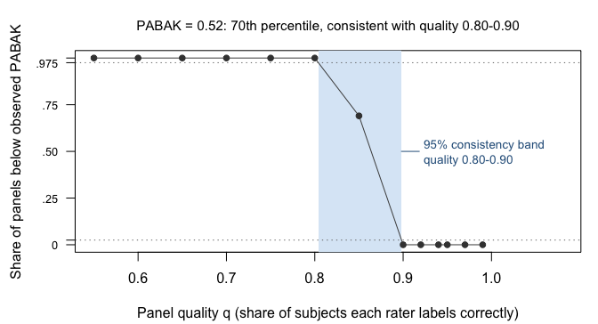
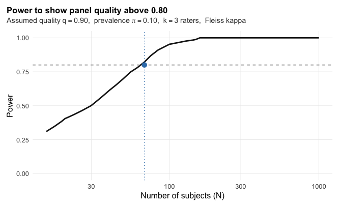

## What grassr does

grassr answers one question about a rating study: how good are these
raters? Give `grass_report()` a matrix of binary ratings, subjects in
rows and raters in columns, and it returns a Report Card with the
coefficient to report, where that value falls among everything a study
with this many raters, this many subjects, and this positive rate could
produce, and the range of rater quality the data are consistent with,
where quality is the share of subjects a rater labels correctly. If the
coefficients imply different qualities, the card flags the panel and
shows the raters one at a time. `grass_power()` sizes a rating study
before any data exist.

The package does not use fixed kappa benchmarks such as the Landis and
Koch (1977) scale. Two raters who each label 87% of subjects correctly
read as *slight* at 5% prevalence, *moderate* at 50%, and *fair* at
90%, even though the underlying rater quality never changed.

## The input

One matrix or data frame, subjects in rows and raters in columns, at
least two raters. Cells are numeric 0/1, `logical`, or a two-level
`factor` or character column, where 1, `TRUE`, or the positive level
means present. For a factor or character column the level named yes,
true, positive, present, or case, in any letter case, is taken as
positive; any other pair of labels is refused with a request for a 0/1
recode. Identifier columns such as a subject ID must be dropped before
the call. Column names, if given, become rater labels on the card.
Ratings must be complete (no missing data). The functions stop on `NA`
rather than dropping rows, so remove incomplete rows first with
`Y <- Y[complete.cases(Y), ]`; the card never sees the dropped rows.

Every row must be a different subject. A 0/1 matrix does not say which
rows share a patient, and stacking repeated measures of one patient as
rows overstates the number of subjects and narrows the quality band
falsely. Build one matrix per repetition or session and compare the
cards.

## Quick start

The example panel is simulated so the card can be checked against a
known answer: 150 subjects at 30% prevalence, three raters who each
label 87% of subjects correctly.


```r
library(grassr)
set.seed(7)
truth <- rbinom(150, 1, 0.30)                  # the true class of each subject
Y0 <- sapply(1:3, function(j)                  # three raters, each 87% correct
  ifelse(truth == 1, rbinom(150, 1, 0.87), rbinom(150, 1, 0.13)))
colnames(Y0) <- c("R1", "R2", "R3")
head(Y0, 8)
#>      R1 R2 R3
#> [1,]  1  0  1
#> [2,]  0  0  0
#> [3,]  0  0  1
#> [4,]  0  0  0
#> [5,]  0  0  0
#> [6,]  1  1  1
#> [7,]  0  0  0
#> [8,]  1  1  0
```


```r
grass_report(ratings = Y0)
#> GRASS Report Card
#> 
#>   sample      = 3 raters, N = 150, pi_hat = 0.36
#>   PABAK        = 0.52  ->  70th percentile | quality 0.80-0.90  <- primary
#>   AC1          = 0.55  ->  70th percentile | quality 0.80-0.90
#>   Fleiss kappa = 0.48  ->  71st percentile | quality 0.80-0.90
#>   ICC          = 0.62  ->  71st percentile | quality 0.81-0.90  [distribution-sensitive]
#>   read: this panel's agreement exceeds 70% of what panels in this study
#>   context can produce; the data are consistent with panel quality 0.80-0.90.
#>   delta       = 0.00 pp implied-quality spread (aligned)
#>   matched null = (k=3, N=150, q=0.86): delta_hat at percentile 11.6 of the
#>   null
#> 
#>   Notes:
#>     - ICC row: N=150 is not a calibrated ICC size, so its reference uses the
#>       nearest on the log scale, N=200. PABAK, AC1, Fleiss kappa, and
#>       delta_hat interpolate at N=150.
#> 
#>   See `summary(...)` for full panel and CI details.
#>   See `plot(...)` for a surface-position visualization.
```

Reading the card, line by line:

- `sample` is the study context: rater count `k`, subject count `N`,
  and the observed positive rate `pi_hat`, the share of all `N x k`
  ratings that are positive. Here `pi_hat` is 0.36
  against a true prevalence of 0.30, because false positives on the
  many negatives outnumber misses on the few positives. Every reference
  panel is simulated in this context.
- Each coefficient line shows the observed value, its percentile, and
  its quality band. The percentile is where the observed value falls
  among everything this study could have produced, from the
  lowest-quality panels in the reference to the highest. The band is
  every quality at which the observed value falls inside the middle 95%
  of that quality's panels; a wide band means the study cannot
  distinguish among those qualities, and a small study always produces
  one. The reference assumes each rater is equally good at positives
  and negatives, so each coefficient traces back to a single quality.
- `<- primary` marks the coefficient to report: PABAK
  (prevalence-adjusted bias-adjusted kappa; Byrt, Bishop, and Carlin,
  1993) at moderate prevalence, and AC1 (Gwet, 2008) when the positive
  rate is below 0.15 or above 0.85 (0.20 or 0.80 at two raters), where
  its percentile is less noisy. The ICC is ICC(1,1) and is tagged
  `[distribution-sensitive]` because its reference depends on how the
  positives are spread across subjects, not only on how many there are,
  so its percentile is less certain than the other three.
- `read` is the headline as a sentence, on the primary coefficient.
  There is no verdict label; the width of the band is the uncertainty.
- `delta` is the spread of the qualities implied by PABAK, AC1, and
  Fleiss' kappa, in percentage points (pp) of quality, followed by its
  flag: `aligned`, `caution`, or `divergent`.

In one sentence, this card says: "Three raters rated 150 subjects,
observed positive rate 0.36. PABAK was 0.52, at the 70th percentile of
what a three-rater, 150-subject study at this positive rate can
produce, and the data are consistent with panel quality 0.80 to 0.90
(spread 0.00 pp, aligned)."

The band comes from a sweep across the calibrated qualities. At each
quality the reference holds the panels that quality produces in this
study context; the curve is the share of them with PABAK below the
observed 0.52. The band is every quality where that share stays between
2.5% and 97.5%.

<div class="figure">

<p class="caption">The consistency band is every quality at which the observed value is neither unusually low nor unusually high.</p>
</div>

**Two raters.** The card is shorter at k = 2. Fleiss' kappa and the ICC
need three or more raters, Cohen's kappa has no calibrated reference,
and PABAK and AC1 always imply the same quality, so the flag is
`not_applicable`. Per-rater sensitivity and specificity are returned as
Hui and Walter (1980) bounds rather than point estimates.

**Intra-rater.** One rater scoring the same subjects on repeated
occasions uses the same layout with the occasions as columns and the
call `grass_report(Y, axis = "intra")`. ICC becomes the primary
coefficient; the three agreement coefficients still print and still
feed the flag.

## When the card flags the panel

The flag answers one question: do these raters differ from each other
enough that one number would hide it? `aligned` means no, and the card
reports the panel as one coefficient with its band. `divergent` means
yes, at least one rater is behaving differently from the rest, and the
card withholds the one-number summary and shows the raters
individually so the odd one out can be found. `caution` is the border.

The test behind it: each of PABAK, AC1, and Fleiss' kappa implies a
panel quality, and `delta_hat` is the gap between the highest and
lowest of the three. Equal-quality raters produce some gap by chance,
so the observed gap is compared with what chance produces at this
rater count, sample size, quality, and prevalence, the matched null the
card names. Below the null's 95th percentile the flag is `aligned`,
from the 95th `caution`, from the 99th `divergent`.

Here five raters score 1,000 subjects at true prevalence 0.30; three
have sensitivity and specificity 0.92, and two keep that sensitivity
but drop to specificity 0.51.


```r
gen_logitnormal <- function(seed, k, N, Se, Sp, pi, F_sigma2 = 0.25) {
  set.seed(seed)
  p_i <- plogis(rnorm(N, qlogis(pi), sqrt(F_sigma2)))
  C   <- rbinom(N, 1L, p_i)
  Y   <- matrix(0L, N, k)
  for (j in seq_len(k)) Y[, j] <- rbinom(N, 1L, ifelse(C == 1L, Se[j], 1 - Sp[j]))
  Y
}
Y_split <- gen_logitnormal(51L, 5L, 1000L,
                            Se = rep(0.92, 5),
                            Sp = c(0.92, 0.92, 0.92, 0.51, 0.51), pi = 0.30)
grass_report(Y_split, bootstrap_B = 200, verbose = FALSE)
#> GRASS Report Card
#> 
#>   sample      = 5 raters, N = 1000, pi_hat = 0.47
#>   PABAK         = 0.36  ->  58th percentile  <- primary
#>   AC1           = 0.38  ->  60th percentile
#>   Fleiss kappa  = 0.36  ->  58th percentile
#>   ICC           = 0.46  ->  58th percentile  [distribution-sensitive]
#>   summary     = suppressed (divergent)
#>   delta       = 0.42 pp (divergent)
#>   matched null = (k=5, N=1000, q=0.80): delta_hat at percentile 99.5 of the
#>   null
#> 
#>   pairwise PABAK / surface percentile (lower / upper):
#>     R1     R2     R3     R4     R5    
#>   R1    --     84%    84%    48%    40% 
#>   R2    0.71   --     81%    45%    41% 
#>   R3    0.70   0.67   --     45%    41% 
#>   R4    0.27   0.24   0.25   --     35% 
#>   R5    0.21   0.22   0.21   0.17   --  
#> 
#>   per-rater vs the majority of the OTHER raters:
#>     R1   Se_tilde = 0.84  Sp_tilde = 0.93  (n_pos = 360, n_neg = 457, excl = 183)
#>     R2   Se_tilde = 0.85  Sp_tilde = 0.91  (n_pos = 352, n_neg = 460, excl = 188)
#>     R3   Se_tilde = 0.83  Sp_tilde = 0.92  (n_pos = 351, n_neg = 459, excl = 190)
#>     R4   Se_tilde = 0.92  Sp_tilde = 0.51  (n_pos = 327, n_neg = 581, excl = 92)
#>     R5   Se_tilde = 0.88  Sp_tilde = 0.50  (n_pos = 330, n_neg = 579, excl = 91)
#>     (excl = subjects the other raters tied on, left out of that rater's pool)
#> 
#>   per-rater (latent-class fit):
#>     R1   Se = 0.93  (0.89, 0.96)   Sp = 0.93  (0.92, 0.96)
#>     R2   Se = 0.92  (0.89, 0.95)   Sp = 0.91  (0.88, 0.93)
#>     R3   Se = 0.89  (0.86, 0.93)   Sp = 0.91  (0.88, 0.94)
#>     R4   Se = 0.93  (0.90, 0.96)   Sp = 0.51  (0.47, 0.55)
#>     R5   Se = 0.89  (0.86, 0.92)   Sp = 0.50  (0.46, 0.54)
#> 
#>   See `summary(...)` for full panel and CI details.
#>   See `plot(...)` for a surface-position visualization.
```

The coefficients look ordinary, but the spread of implied quality lies
beyond the 99th percentile of what chance produces in this study (the
card prints 99.5, the top of its stored null), so the card drops the bands and the `read:` line, marks the summary
`suppressed`, and shows the raters one at a time in three views:

- The pairwise PABAK matrix, each pair's PABAK in the lower triangle
  and its percentile in the upper. R1 to R3 agree at the 81st to 84th
  percentile; every pair involving R4 or R5 is at the 48th or below.
- The majority table scores each rater against the majority vote of
  the other raters, tied subjects excluded. `Se_tilde` is the share of
  subjects the others called positive that this rater also called
  positive; `Sp_tilde` is the same share on the subjects the others
  called negative. R4 and R5 are over-callers: `Sp_tilde` 0.51 and 0.50
  against 0.91 to 0.93 for the rest.
- The latent-class fit (Dawid and Skene, 1979) estimates each rater's
  sensitivity and specificity from the ratings alone, with bootstrap
  intervals from `bootstrap_B` resamples (1,000 by default; 200 here to
  run quickly). Because nothing in the ratings says which hidden class
  is the positive one, it can report every rater's two numbers
  swapped. The majority table is the safe view and the latent-class
  fit is the check.

This panel does not need more raters or more subjects. It needs R4 and
R5 retrained on when to call a subject negative. In one sentence:
"Five raters rated 1,000 subjects, observed positive rate 0.47. The
qualities implied by the three agreement coefficients were 0.42
percentage points apart, beyond the 99th percentile of what
equal-quality raters produce in this study context, so the panel is not
summarized
by one coefficient. Against the majority of the other raters, R4 and R5
had specificity 0.51 and 0.50 versus 0.91 to 0.93 for the rest."

A `caution` card keeps its bands and is read the same way as an aligned
card, after a look at the pairwise table.

The flag detects raters who disagree with each other. A panel that is
wrong together, every rater sharing the same specificity deficit,
raises no flag, because no internal comparison can see it. Only an
external reference standard catches that case.

## Planning a study: `grass_power()`

Assume a prevalence and a rough rater quality, and `grass_power()`
gives the probability that a study of a given size shows panel quality
above a value you choose, and the size at which that probability
reaches the level you want. Fix four of quality, prevalence, rater
count, sample size, and power, and it solves for the fifth. Give
`prevalence =` when planning; give `pi_hat =` only when a card is
already in hand, since the card reports the observed positive rate and
the function converts between the two. Here the panel is assumed to be
0.90 and a screening study with three raters at 10% prevalence is sized
to show it is above 0.80.


```r
pw <- grass_power("fleiss_kappa", q = 0.90, q0 = 0.80, prevalence = 0.10,
                  k = 3, power = 0.80)
pw
#> 
#>      GRASS power analysis: show panel quality above 0.80 (panel assumed 0.90)
#>      coefficient: Fleiss kappa
#> 
#>            q = 0.90
#>   prevalence = 0.10
#>       pi_hat = 0.18  (implied)
#>            k = 3
#>            N = 61  <- solved
#>        power = 0.80
#> 
#>   Power is the probability that a study of this size shows panel quality
#>   above 0.80 when the panel is 0.90.
#>   See `plot()` for the curve over Number of subjects (N).
plot(pw)
```

<div class="figure">

<p class="caption">Power curve over sample size for the planned screening study, with the requested power as a dashed line and the solved N marked.</p>
</div>

Solve for `k` instead and the function returns the smallest rater
count that reaches the power, or `NA` with the reason. Rater count
snaps to the calibrated grid (2, 3, 5, 8, 15, 25). Leave the prevalence
empty and it returns the range of prevalences over which a fixed design
keeps that power. `target =` sizes a study against a fixed coefficient
value instead, for a threshold imposed from outside. Plan on the
coefficient the card will mark primary.

## Other functions and views

`grass_report()` composes four functions, each callable on a rating
matrix:

- `position_on_surface()` returns the percentile, band, and implied
  quality for one coefficient. Given a hypothetical value and a study
  context instead of a matrix, it answers a planning question.
- `check_asymmetry()` returns `delta_hat` and its flag without
  per-rater detail.
- `pairwise_agreement()` returns the pairwise matrix and the majority
  table for any panel, flagged or not.
- `latent_class_fit()` returns the per-rater sensitivity and
  specificity table, and at two raters the Hui and Walter bounds.

`plot_surface()` draws a coefficient's expected value over prevalence
and quality for a planned rater count and sample size, with an
`observed` value pinned on it.

A card has three other views. `summary(card)` prints the full panel,
every caveat from the surface lookup, the package version, and the
timestamp. `as.data.frame(card)` returns one row per coefficient, for
binding many studies' cards into one table; `delta_hat` is in quality
percentage points, the unit the card prints. `plot(card)` places the
panel on the primary coefficient's expected-value surface over
prevalence and quality.

Other `plot()` types (`type = "thermometer"` for the `delta_hat` gauge,
`"panel"`, `"intervals"`, `"per_rater"`, `"diagnostic"`) are documented
in `?plot.grass_card`.

## Reference

Every percentile and band comes from a bundled simulated reference.
Study contexts between calibrated cells interpolate in quality, sample
size, and prevalence; rater count snaps to the nearest calibrated
value, and the card says so. A coefficient outside the range its study
context can produce is clamped to the nearest edge, marked
`clamped = TRUE` in the panel data frame, and dropped from `delta_hat`.
The simulation programs are in the source repository under
`simulation/`.

- Semmel, A. & Gidaro, R. (2026). *A context-conditioned reporting
  convention for rater reliability on binary outcomes.* (Working
  paper.) The package is the computational companion to this work.
- Byrt, T., Bishop, J. & Carlin, J. B. (1993). Bias, prevalence and
  kappa. *Journal of Clinical Epidemiology* 46(5), 423-429.
- Dawid, A. P. & Skene, A. M. (1979). Maximum likelihood estimation
  of observer error-rates using the EM algorithm. *Applied
  Statistics* 28(1), 20-28.
- Gwet, K. L. (2008). Computing inter-rater reliability and its
  variance in the presence of high agreement. *British Journal of
  Mathematical and Statistical Psychology* 61(1), 29-48.
- Hui, S. L. & Walter, S. D. (1980). Estimating the error rates of
  diagnostic tests. *Biometrics* 36(1), 167-171.
- Landis, J. R. & Koch, G. G. (1977). The measurement of observer
  agreement for categorical data. *Biometrics* 33(1), 159-174.
