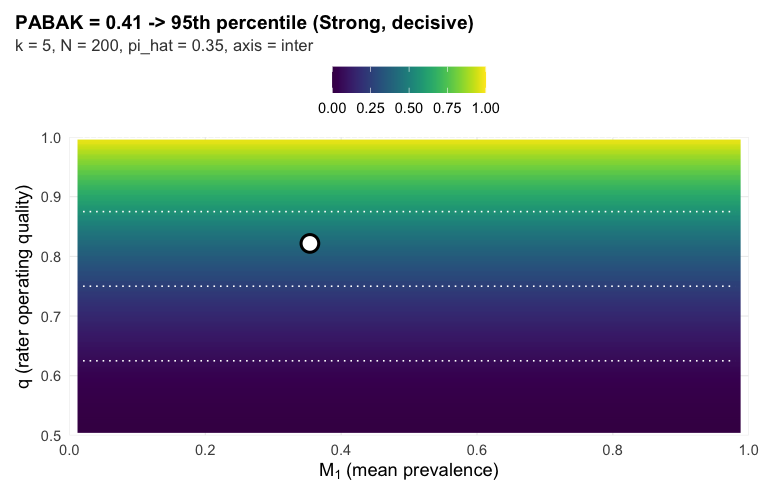
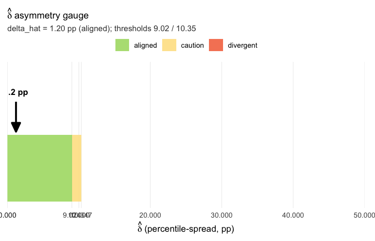
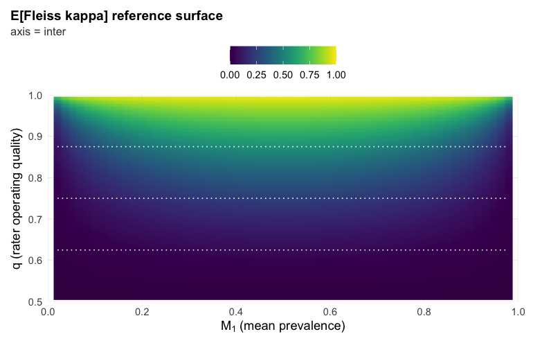
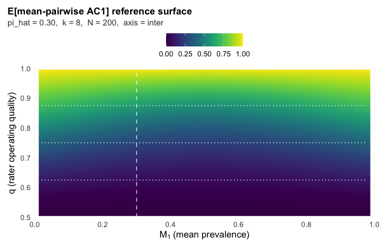
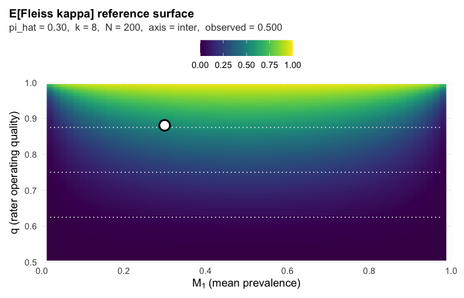

## Abstract

Rater-reliability coefficients drift with prevalence, rater count, and
sample size, so a fixed-cutoff label like "substantial agreement" can
land on the same panel and mean different things. This package replaces
fixed cutoffs with a context-conditioned **Report Card**, computed in one
call from the rating matrix alone. The workflow returns four fields: the
sample summary, the primary coefficient with its surface percentile, the
cross-coefficient asymmetry diagnostic, and (when the panel disagrees
with itself) a per-rater latent-class fit.

### What's new in 0.6.0

- **Krippendorff's α removed from the Report Card and δ̂ (0.6.0):**
  in the binary fully-crossed designs this package targets, α
  coincides with Fleiss' κ asymptotically (median absolute
  difference 0.00024 across the 10,140-cell calibration grid), so
  its row added no information and its small-sample deviation could
  tip borderline δ̂ readings across a threshold on noise alone. δ̂ is
  now the percentile spread over PABAK, mean AC1, and Fleiss' κ; the
  bundled thresholds hold for the 3-coefficient spread (sub-pp
  shift, within MC-SE). `obs_krippendorff_alpha()` is exported for
  anyone needing the value, and
  `position_on_surface(metric = "krippendorff_a")` still positions
  it on its closed-form reference.
- **Legacy pre-0.2.0 API removed (0.6.0):** `grass_format_report()`,
  `grass_methods()`, `grass_report_by()`, and the `grass_result`
  methods. See `NEWS.md`.

Full release history, including the 0.5.x sysdata corrections, is
in `NEWS.md`.

## 1. The headline call

The entire workflow is three lines: load the package, pass an `N x k`
binary rating matrix, print the result.


```r
library(grassr)
set.seed(2026)

# Tiny demo: 5 raters, 200 subjects, modest agreement.
truth <- rbinom(200, 1, 0.30)
Y <- sapply(1:5, function(j) {
  ifelse(truth == 1, rbinom(200, 1, 0.85), rbinom(200, 1, 0.15))
})

grass_report(ratings = Y)
#> GRASS Report Card
#> 
#>   sample      = 5 raters, N = 200, pi_hat = 0.34
#>   PABAK        = 0.47  ->  27th percentile  (decisive)  <- primary
#>   AC1          = 0.52  ->  26th percentile
#>   Fleiss kappa = 0.41  ->  31st percentile
#>   ICC          = 0.53  ->  50th percentile  [distribution-sensitive]
#>   delta       = 4.7 pp (aligned)
#>   matched null = (k=5, N=200, q=0.85): delta_hat at the 68.7 percentile [design snapped]
#> 
#>   Notes:
#>     - Fitted-ICC F_key picked via glmer: mu_hat=-1.039, tau2_hat=3.669 -> F_key tau2=4.0000, mu=-0.847.
#>     - Fitted-ICC reference (GLMM-gap corrected) at F_key=LN_mu=-0.847_tau2=4.0000, k=5, N=200 (family=logit_normal, M1=0.374).
#>     - delta_hat is computed over the agreement family (PABAK, AC1, Fleiss, alpha). ICC is reported on the panel but does not enter delta_hat (v0.5.0 scope: ICC's reference surface depends on the full subject-prevalence distribution F and does not share the (q, pi_+) sufficient statistic the agreement family does).
#>     - flag from delta_hat's percentile on the matched null (k=5, N=200, q=0.85; 50,000 draws); design snapped to nearest calibrated cell.
#> 
#>   See `summary(...)` for full panel and CI details.
#>   See `plot(...)` for a surface-position visualization.
```

Each block in the printed Report Card means something specific:

- **`sample`** describes the study: rater count `k`, subject count `N`,
  and the observed positive rate `pi_hat = mean(Y)`.
- **The primary coefficient line** (e.g. `PABAK = 0.41 -> 95th pct (decisive)`)
  shows the observed value, where it lands on the reference surface
  *for this study's `(k, N, pi_hat)`*, and the confidence qualifier
  (decisive / moderate / weak) reflecting the local envelope width.
  The percentile is the categorical score; no four-way labeled band
  sits between the percentile and the reader.
- **`delta`** is the cross-coefficient percentile spread in pp across
  the agreement family (PABAK, AC1, Fleiss kappa;
  ICC excluded by construction). The caution and divergent cuts are
  read as a percentile on the matched `(k, N, q̂)` null distribution (`delta_null_ecdf`); at the
  modal applied design `(k = 5, N = 200)` the pair is `(9.25, 10.75)`
  pp. Below the caution cut the panel is *aligned* and the primary
  coefficient is safe to cite; above the divergent cut the panel-
  aggregate is suppressed in favor of the pairwise PABAK matrix and
  per-rater pooled-reference Se/Sp.

## 2. A symmetric panel (the easy case)

Five raters with the same accuracy (Se = Sp = 0.85) on a moderate-prevalence
binary task. The panel should land in the *aligned* tier: every coefficient
agrees about where the panel sits, so a single number is enough.


```r
set.seed(29)
N <- 200; k <- 5
truth <- rbinom(N, 1, 0.30)
Y_sym <- sapply(1:k, function(j) {
  ifelse(truth == 1, rbinom(N, 1, 0.85), rbinom(N, 1, 0.15))
})

card_sym <- grass_report(ratings = Y_sym)
card_sym
#> GRASS Report Card
#> 
#>   sample      = 5 raters, N = 200, pi_hat = 0.35
#>   PABAK        = 0.41  ->  95th percentile  (decisive)  <- primary
#>   AC1          = 0.46  ->  94th percentile
#>   Fleiss kappa = 0.36  ->  95th percentile
#>   ICC          = 0.46  ->  50th percentile  [distribution-sensitive]
#>   delta       = 1.2 pp (aligned)
#>   matched null = (k=5, N=200, q=0.85): delta_hat at the 5.1 percentile [design snapped]
#> 
#>   Notes:
#>     - Fitted-ICC F_key picked via glmer: mu_hat=-0.877, tau2_hat=2.801 -> F_key tau2=4.0000, mu=-0.847.
#>     - Fitted-ICC reference (GLMM-gap corrected) at F_key=LN_mu=-0.847_tau2=4.0000, k=5, N=200 (family=logit_normal, M1=0.374).
#>     - delta_hat is computed over the agreement family (PABAK, AC1, Fleiss, alpha). ICC is reported on the panel but does not enter delta_hat (v0.5.0 scope: ICC's reference surface depends on the full subject-prevalence distribution F and does not share the (q, pi_+) sufficient statistic the agreement family does).
#>     - flag from delta_hat's percentile on the matched null (k=5, N=200, q=0.85; 50,000 draws); design snapped to nearest calibrated cell.
#> 
#>   See `summary(...)` for full panel and CI details.
#>   See `plot(...)` for a surface-position visualization.
```

Note three things:

1. The `flag` is `aligned` (`delta = 1.2 pp`, well below the
   95th-percentile caution convention on the matched null). One coefficient is safe to cite.
2. Only the primary coefficient prints (PABAK, picked automatically by
   the `(k, pi_hat)` rule from Table 2 of the paper). The full panel of
   four coefficients is still computed and stored on the object; it is
   just not the headline.
3. The qualifier (`decisive`) is calibrated, not inherited from a
   fixed-band convention: it is the bootstrap probability that the
   modal surface region survives perturbation of `(q_hat, pi_hat)`,
   mapped to decisive / moderate / weak at 0.90 / 0.60. A four-band
   label is computed and stored on the object for programmatic use;
   the printed headline carries the percentile and the qualifier only.

## 3. A divergent panel

Now the paper's divergent worked example (the `op_strong` profile): five raters with
*alternating* per-rater bias direction at balanced prevalence. Three
raters lean toward over-calling (Se = 0.95, Sp = 0.75); two lean toward
under-calling (Se = 0.75, Sp = 0.95). The asymmetry is severe per
rater but cancels in the panel-aggregate marginals, so each
agreement coefficient returns roughly the same observed value, yet
their inversions onto the (symmetric-DGP) reference surfaces split
across percentiles. This is the configuration where the headline
`grass_report` flag flips from a single coherent reading to a
per-rater diagnostic.


```r
set.seed(6)
N <- 1000; k <- 5
# Alternating per-rater Se/Sp asymmetry: R1, R3, R5 favor sensitivity;
# R2, R4 favor specificity. Subject-level positive probabilities are
# logit-normal around balanced prevalence (the paper's divergent DGP).
Se <- c(0.95, 0.75, 0.95, 0.75, 0.95)
Sp <- c(0.75, 0.95, 0.75, 0.95, 0.75)
p_i   <- plogis(rnorm(N, qlogis(0.50), sqrt(0.25)))
truth <- rbinom(N, 1L, p_i)
Y_div <- matrix(0L, N, k)
for (j in seq_len(k)) {
  Y_div[, j] <- rbinom(N, 1L, ifelse(truth == 1L, Se[j], 1 - Sp[j]))
}

card_div <- grass_report(ratings = Y_div, bootstrap_B = 200)
card_div
#> GRASS Report Card
#> 
#>   sample      = 5 raters, N = 1000, pi_hat = 0.50
#>   PABAK         = 0.49  ->  40th percentile  <- primary
#>   AC1           = 0.49  ->  58th percentile
#>   Fleiss kappa  = 0.49  ->  41st percentile
#>   ICC           = 0.62  ->  50th percentile  [distribution-sensitive]
#>   panel-agg.  = suppressed (divergent)
#>   delta       =  18 pp (divergent)
#>   matched null = (k=5, N=1000, q=0.85): delta_hat at the 99.5 percentile [design snapped]
#> 
#>   pairwise PABAK / surface percentile (lower / upper):
#>     R1     R2     R3     R4     R5    
#>   R1    --     25%    79%    43%    98% 
#>   R2    0.47   --     97%    90%    17% 
#>   R3    0.51   0.41   --     98%    96% 
#>   R4    0.48   0.52   0.42   --     62% 
#>   R5    0.55   0.46   0.54   0.50   --  
#> 
#>   per-rater vs panel-majority of OTHER raters (pooled-reference):
#>     R1   Se_tilde = 0.94  Sp_tilde = 0.77  (n_pos = 434, n_neg = 471, excl = 95)
#>     R2   Se_tilde = 0.71  Sp_tilde = 0.95  (n_pos = 466, n_neg = 439, excl = 95)
#>     R3   Se_tilde = 0.95  Sp_tilde = 0.71  (n_pos = 433, n_neg = 485, excl = 82)
#>     R4   Se_tilde = 0.74  Sp_tilde = 0.95  (n_pos = 468, n_neg = 441, excl = 91)
#>     R5   Se_tilde = 0.96  Sp_tilde = 0.78  (n_pos = 428, n_neg = 476, excl = 96)
#> 
#>   per-rater (latent-class fit; alongside pairwise):
#>     R1   Se = 0.95  (0.23, 0.97)   Sp = 0.78  (0.06, 0.82)
#>     R2   Se = 0.73  (0.05, 0.77)   Sp = 0.95  (0.29, 0.97)
#>     R3   Se = 0.96  (0.29, 0.97)   Sp = 0.72  (0.05, 0.76)
#>     R4   Se = 0.75  (0.05, 0.79)   Sp = 0.95  (0.26, 0.97)
#>     R5   Se = 0.96  (0.22, 0.98)   Sp = 0.78  (0.04, 0.82)
#> 
#>   Notes:
#>     - Fitted-ICC F_key picked via glmer: mu_hat=0.005, tau2_hat=5.278 -> F_key tau2=4.0000, mu=0.000.
#>     - Fitted-ICC reference (GLMM-gap corrected) at F_key=LN_mu=+0.000_tau2=4.0000, k=5, N=1000 (family=logit_normal, M1=0.500).
#>     - delta_hat is computed over the agreement family (PABAK, AC1, Fleiss, alpha). ICC is reported on the panel but does not enter delta_hat (v0.5.0 scope: ICC's reference surface depends on the full subject-prevalence distribution F and does not share the (q, pi_+) sufficient statistic the agreement family does).
#>     - flag from delta_hat's percentile on the matched null (k=5, N=1000, q=0.85; 50,000 draws); design snapped to nearest calibrated cell.
#> 
#>   See `summary(...)` for full panel and CI details.
#>   See `plot(...)` for a surface-position visualization.
```

The flag is `divergent`: the cross-coefficient percentile spread
clears the divergent convention printed on the card (99th percentile of the matched null; the implied cut in pp is shown, snapped
from the nearest calibrated cell) even though the three agreement
coefficients (PABAK, AC1, Fleiss kappa) all sit
near the same observed value. Three things change in the printed
output:

1. The full panel of percentiles prints, not just the primary, so the
   reader can see that AC1 separates from the kappa-family
   coefficients.
2. The `band` is `suppressed`. Picking a single number from a panel
   whose coefficients disagree on the surface position would hide the
   asymmetry.
3. The per-rater table appears. A latent-class fit (Dawid-Skene EM at
   k >= 3, Hui-Walter bounds at k = 2) recovers each rater's
   sensitivity and specificity with bootstrap confidence intervals.
   The recovered estimates pin the panel's structure: R1, R3, R5 land
   near (Se, Sp) = (0.95, 0.75), R2, R4 near (0.75, 0.95). The
   bootstrap CIs are wide because the latent-class likelihood becomes
   ridge-flat near balanced prevalence and the bootstrap resamples
   both the correct mode and its label-switched counterpart; the
   point estimates pin the local mode, but without external
   orientation the practitioner cannot assert from the rating matrix
   alone which raters are over- versus under-callers.

### Pairwise reliability under the divergent flag

When the panel is divergent the framework's recommended primary
deliverable is `pairwise_agreement()`: a `k x k` matrix of pairwise
PABAK values, each placed on the `k = 2` reference surface at the
pair's observed marginal, plus per-rater behavior against the
panel-majority of the *other* `k - 1` raters as a proxy reference.
The pairwise matrix exposes the panel's structure directly, and the
pooled-reference per-rater table avoids the latent-class
identifiability problem (label-switching is moot because the
"reference" is the observable panel majority, not a latent class).


```r
pw <- pairwise_agreement(Y_div)
pw
#> GRASS Pairwise Reliability
#> 
#>   sample      = 5 raters, N = 1000, pi_hat = 0.50, tau2_hat = 0.122, axis = inter
#> 
#>   Pairwise PABAK (lower triangle = PABAK_ij; upper triangle = surface percentile):
#> 
#>    R1     R2     R3     R4     R5    
#> R1     --   25%    79%    43%    98% 
#> R2   0.47     --   97%    90%    17% 
#> R3   0.51   0.41     --   98%    96% 
#> R4   0.48   0.52   0.42     --   62% 
#> R5   0.55   0.46   0.54   0.50     --
#> 
#>   Per-rater behavior against pooled panel-majority:
#> 
#>  rater Se_tilde Sp_tilde n_pos n_neg n_excl
#>     R1     0.94     0.77   434   471     95
#>     R2     0.71     0.95   466   439     95
#>     R3     0.95     0.71   433   485     82
#>     R4     0.74     0.95   468   441     91
#>     R5     0.96     0.78   428   476     96
#>   (Se_tilde, Sp_tilde are calls vs panel-majority of OTHER raters,
#>    not against external truth. n_excl: subjects with tied majority,
#>    excluded from the per-rater pool.)
```

Read the per-rater table: with R1, R3, R5 favoring sensitivity and
R2, R4 favoring specificity, the pooled-reference
estimates pin each rater's bias direction without ambiguity. R1's
`Se_tilde` is high (calls true positives at panel-majority rate)
while `Sp_tilde` is lower (calls panel-majority negatives less
reliably): the over-caller signature. R2 shows the mirror: low
`Se_tilde`, high `Sp_tilde`. The latent-class fit's wide bootstrap
CIs in the paper's divergent example had to live with the
label-switched mode;
the pooled-reference per-rater table sidesteps that ambiguity.

The pairwise PABAK matrix lower triangle shows the actual pairwise
agreements; the upper triangle shows surface percentiles at each
pair's observed marginal. Note that the same PABAK value can land
at different surface percentiles across pairs because each pair
sees a different `pi_hat_ij`; the divergent flag is exposing
exactly this prevalence-by-pair structure that a panel-aggregate
summary would have averaged away.

## 4. Layered access

Every field beneath the printed Report Card is available on demand.


```r
summary(card_sym)
#> GRASS Report Card -- summary
#> 
#>   sample       : k = 5 raters, N = 200, pi_hat = 0.354, axis = inter
#>   tau2_hat     : 0.083
#> 
#>   primary coefficient
#>     name         : pabak
#>     observed     : 0.414
#>     percentile   : 95.42 pp
#>     band         : Strong
#>     qualifier    : decisive
#> 
#>   delta (cross-coefficient asymmetry)
#>     delta_hat    : 1.20 pp
#>     flag         : aligned
#>     thresholds   : caution = 9.02, divergent = 10.35
#> 
#>   panel (full table)
#>     pabak           observed = 0.414  pct = 95.42 pp  band = Strong       qualifier = decisive
#>     mean_ac1        observed = 0.460  pct = 94.22 pp  band = Strong       qualifier = decisive
#>     fleiss_kappa    observed = 0.359  pct = 94.67 pp  band = Strong       qualifier = decisive
#>     icc             observed = 0.464  pct = 50.00 pp  band = Strong       qualifier = decisive
#> 
#>   notes
#>     - Fitted-ICC F_key picked via glmer: mu_hat=-0.877, tau2_hat=2.801 -> F_key tau2=4.0000, mu=-0.847.
#>     - Fitted-ICC reference (GLMM-gap corrected) at F_key=LN_mu=-0.847_tau2=4.0000, k=5, N=200 (family=logit_normal, M1=0.374).
#>     - delta_hat is computed over the agreement family (PABAK, AC1, Fleiss, alpha). ICC is reported on the panel but does not enter delta_hat (v0.5.0 scope: ICC's reference surface depends on the full subject-prevalence distribution F and does not share the (q, pi_+) sufficient statistic the agreement family does).
#>     - flag from delta_hat's percentile on the matched null (k=5, N=200, q=0.85; 50,000 draws); design snapped to nearest calibrated cell.
#> 
#>   grass version : 0.7.0
#>   timestamp     : 2026-07-05 14:03:33
```

`summary()` is the *audit view*: full panel of coefficients with
percentiles and bands, all caveats from the surface lookup, the GRASS
version, the timestamp. Use it when you want to see what the headline
hides.


```r
head(as.data.frame(card_sym), 5)
#>    coefficient observed_value surface_percentile   band qualifier
#> 1        pabak      0.4140000           95.41694 Strong  decisive
#> 2     mean_ac1      0.4601604           94.21535 Strong  decisive
#> 3 fleiss_kappa      0.3593780           94.66860 Strong  decisive
#> 4          icc      0.4641657           50.00000 Strong  decisive
#>   band_probability_modal     q_hat    se_q_hat clamped reference_used
#> 1                      1 0.8217138 0.013797700   FALSE    closed-form
#> 2                      1 0.8217650 0.013796793   FALSE    closed-form
#> 3                      1 0.8217138 0.013797700   FALSE    closed-form
#> 4                      1 0.8075234 0.005569156   FALSE     fitted-icc
#>   in_delta_hat is_primary
#> 1         TRUE       TRUE
#> 2         TRUE      FALSE
#> 3         TRUE      FALSE
#> 4        FALSE      FALSE
```

`as.data.frame()` is the *tidy view*: one row per coefficient with
`observed_value`, `surface_percentile`, `band`, `qualifier`, and
`is_primary`. Use it when you want to bind many studies' Report Cards
into one table for a meta-analysis or to feed the panel into another
analysis pipeline.


```r
plot(card_sym)                       # default: surface with observation pinned
#> Warning: The following aesthetics were dropped during statistical transformation: fill.
#> ℹ This can happen when ggplot fails to infer the correct grouping structure in
#>   the data.
#> ℹ Did you forget to specify a `group` aesthetic or to convert a numerical
#>   variable into a factor?
#> Warning: Removed 120 rows containing missing values or values outside the scale range
#> (`geom_raster()`).
```

<div class="figure">

<p class="caption">plot of chunk plot-surface</p>
</div>


```r
plot(card_sym, type = "thermometer") # delta_hat thermometer
#> Warning: Removed 1 row containing missing values or values outside the scale range
#> (`geom_rect()`).
```

<div class="figure">

<p class="caption">plot of chunk plot-thermometer</p>
</div>

The default `plot()` view is a heatmap of the expected primary
coefficient over `(M_1, q)` at the study's `(k, N)`, with a single
point pinned at the observed coordinates. The `thermometer` view
isolates `delta_hat` against the matched-null caution and divergent conventions; useful
when the question is *"is the panel stable enough to cite a single
number?"*. Additional views (`type = "panel"` for the cross-coefficient
spread, `type = "intervals"` for forest-style CIs, `type = "per_rater"`
for the divergent-branch per-rater forest, `type = "diagnostic"` for a
combined patchwork) are documented in `?plot.grass_card`.

## 5. Granular building blocks

For users who want lower-level control, three of the internals
`grass_report()` calls are exported:


```r
position_on_surface(ratings = Y_sym, metric = "pabak")
#> grass surface-position report (Target-2 reporting convention)
#>   metric               : pabak
#>   observed value       : 0.414
#>   design (pi_hat,k,N)  : (0.354, 5, 200)
#>   q_hat (scaffold)     : 0.822 +/- 0.014
#>   surface percentile   : 0.954
#>   band probabilities   :
#>     Poor       0.000
#>     Moderate   0.000
#>     Strong     1.000 <- modal
#>     Excellent  0.000
#>   label                : Strong (decisive)
#>   sampling method      : empirical
```

`position_on_surface()` does the surface lookup for a single coefficient
and returns the percentile, band, and band-probability vector.


```r
check_asymmetry(ratings = Y_sym)
#> GRASS panel asymmetry diagnostic
#> 
#>   delta_hat = 1.2 pp
#>   flag      = aligned  (5.1 percentile of matched null: k=5, N=200, q=0.85)
#> 
#>   panel:
#>     coefficient        observed   percentile (pp)   in delta_hat
#>     pabak              0.41       95.4             yes
#>     mean_ac1           0.46       94.2             yes
#>     fleiss_kappa       0.36       94.7             yes
#>     icc                0.46       50.0             no [distribution-sensitive]
#> 
#>   Surface caveats:
#>     - Fitted-ICC F_key picked via glmer: mu_hat=-0.877, tau2_hat=2.801 -> F_key tau2=4.0000, mu=-0.847.
#>     - Fitted-ICC reference (GLMM-gap corrected) at F_key=LN_mu=-0.847_tau2=4.0000, k=5, N=200 (family=logit_normal, M1=0.374).
#>     - delta_hat is computed over the agreement family (PABAK, AC1, Fleiss, alpha). ICC is reported on the panel but does not enter delta_hat (v0.5.0 scope: ICC's reference surface depends on the full subject-prevalence distribution F and does not share the (q, pi_+) sufficient statistic the agreement family does).
#>     - flag from delta_hat's percentile on the matched null (k=5, N=200, q=0.85; 50,000 draws); design snapped to nearest calibrated cell.
```

`check_asymmetry()` returns the cross-coefficient percentile spread and
the (aligned / caution / divergent) flag without computing per-rater
detail. Cheap when you want only the diagnostic.


```r
latent_class_fit(ratings = Y_div, B = 200)
#> grass latent-class fit
#>   method        : dawid_skene_em
#>   raters (k)    : 5
#>   bootstrap B   : 200
#>   converged     : TRUE
#>   iterations    : 10
#>   prevalence_hat: 0.475
#>   log-likelihood: -2504.371
#>   per-rater
#>     R1    Se = 0.950  (0.201, 0.970)   Sp = 0.783  (0.050, 0.817)
#>     R2    Se = 0.729  (0.042, 0.770)   Sp = 0.953  (0.259, 0.973)
#>     R3    Se = 0.956  (0.262, 0.973)   Sp = 0.718  (0.036, 0.764)
#>     R4    Se = 0.750  (0.044, 0.784)   Sp = 0.949  (0.259, 0.965)
#>     R5    Se = 0.962  (0.206, 0.980)   Sp = 0.781  (0.038, 0.812)
```

`latent_class_fit()` produces the per-rater Se/Sp table directly, with
Dawid-Skene EM and a nonparametric bootstrap CI at k >= 3.

## 6. Two-rater binary case (k = 2)

The headline call works at k = 2 with no signature change:


```r
set.seed(42)
N <- 200
truth <- rbinom(N, 1, 0.30)
Y_k2 <- cbind(
  ifelse(truth == 1, rbinom(N, 1, 0.85), rbinom(N, 1, 0.15)),
  ifelse(truth == 1, rbinom(N, 1, 0.85), rbinom(N, 1, 0.15))
)

grass_report(ratings = Y_k2)
#> GRASS Report Card
#> 
#>   sample      = 2 raters, N = 200, pi_hat = 0.39
#>   PABAK  = 0.50  ->  56th percentile  (decisive)  <- primary
#>   AC1    = 0.52  ->  57th percentile
#>   delta       = 0.4 pp (aligned)
#>   matched null = (k=2, N=200, q=0.85): delta_hat at the 30.0 percentile [design snapped]
#> 
#>   Notes:
#>     - flag from delta_hat's percentile on the matched null (k=2, N=200, q=0.85; 50,000 draws); design snapped to nearest calibrated cell.
#> 
#>   See `summary(...)` for full panel and CI details.
#>   See `plot(...)` for a surface-position visualization.
```

When the panel goes divergent at k = 2, per-rater Se and Sp are not
point-identified from the rating matrix alone (there is one fewer
constraint than parameter). The latent-class fit returns Hui-Walter
*bounds* rather than point estimates:


```r
latent_class_fit(ratings = Y_k2, B = 200)
#> grass latent-class fit
#>   method        : hui_walter
#>   raters (k)    : 2
#>   bootstrap B   : 200
#>   per-rater
#>     R1    Se in [0.395, 1.000]   Sp in [0.605, 1.000]   (bounds)
#>     R2    Se in [0.385, 1.000]   Sp in [0.615, 1.000]   (bounds)
#> 
#>   Note: at k = 2, per-rater Se/Sp are not point-identified
#>         without external information. The intervals are
#>         Hui-Walter (1980) inequality bounds, not point
#>         estimates with sampling uncertainty.
```

The bounds carry the same meaning as the k >= 3 point estimates: an
honest representation of what the data say about each rater. At k = 2
that is a range; at k >= 3 it is a point with uncertainty.

## 7. Surface-envelope clamp (an edge case worth knowing about)

`delta_hat` measures cross-coefficient surface-percentile spread. If
one of the panel's coefficients reports an observed value that falls
outside the achievable range of its reference surface at the study's
design `(pi_hat, k, N)`, the inversion to `q_hat` clamps to the
surface boundary and the percentile lands at exactly 0 or 100. Since
v0.2.2, `check_asymmetry()` and `grass_report()` *exclude* such
clamped coefficients from `delta_hat` whenever at least two unclamped
coefficients remain — otherwise a single clamped coefficient could
inflate the spread by 100 pp and fire a false `divergent` flag.

The most common trigger is ICC at `N > 200`. The bundled fitted-ICC
reference is calibrated at `N` in `{50, 200}`; beyond that, the
function falls back to the oracle ICC reference (closed-form, no
GLMM-gap correction), which over-predicts the practitioner's
glmer-fit ICC and clamps the percentile to 0:


```r
# A panel where ICC clamps but the three agreement coefficients align.
set.seed(5)
N <- 1000L; k <- 5L
mu_logit <- qlogis(0.08)
p_i <- plogis(rnorm(N, mu_logit, sqrt(0.25)))
truth <- rbinom(N, 1, p_i)
Y_clamp <- matrix(0L, N, k)
for (j in seq_len(k)) {
  Y_clamp[, j] <- rbinom(N, 1, ifelse(truth == 1, 0.85, 0.15))
}
card_clamp <- grass_report(Y_clamp, bootstrap_B = 50)
card_clamp
#> GRASS Report Card
#> 
#>   sample      = 5 raters, N = 1000, pi_hat = 0.21
#>   PABAK        = 0.49  ->  46th percentile  (decisive)  <- primary
#>   AC1          = 0.62  ->  46th percentile
#>   Fleiss kappa = 0.23  ->  47th percentile
#>   ICC          = 0.33  ->  50th percentile  [distribution-sensitive]
#>   delta       =   1 pp (aligned)
#>   matched null = (k=5, N=1000, q=0.85): delta_hat at the 12.5 percentile [design snapped]
#> 
#>   Notes:
#>     - Fitted-ICC F_key picked via glmer: mu_hat=-1.716, tau2_hat=1.633 -> F_key tau2=1.0000, mu=-1.386.
#>     - Fitted-ICC reference (GLMM-gap corrected) at F_key=LN_mu=-1.386_tau2=1.0000, k=5, N=1000 (family=logit_normal, M1=0.239).
#>     - delta_hat is computed over the agreement family (PABAK, AC1, Fleiss, alpha). ICC is reported on the panel but does not enter delta_hat (v0.5.0 scope: ICC's reference surface depends on the full subject-prevalence distribution F and does not share the (q, pi_+) sufficient statistic the agreement family does).
#>     - flag from delta_hat's percentile on the matched null (k=5, N=1000, q=0.85; 50,000 draws); design snapped to nearest calibrated cell.
#> 
#>   See `summary(...)` for full panel and CI details.
#>   See `plot(...)` for a surface-position visualization.
```

The printed Report Card surfaces the clamp in two places: the
`Notes` section names which coefficient was excluded and why, and
under the `divergent` flag the panel display marks each clamped
coefficient row with `[clamped - excluded from delta]`. The `panel`
data.frame on the returned object also carries a `clamped` logical
column for programmatic inspection:


```r
card_clamp$panel[, c("coefficient", "surface_percentile",
                     "band", "clamped")]
#>    coefficient surface_percentile   band clamped
#> 1        pabak           46.27444 Strong   FALSE
#> 2     mean_ac1           45.50669 Strong   FALSE
#> 3 fleiss_kappa           46.52487 Strong   FALSE
#> 4          icc           50.00000 Strong   FALSE
```

The trade-off: a coefficient with no calibrated reference at the
user's design contributes nothing to the diagnostic. The benefit:
when `delta_hat` does fire `divergent`, it reflects genuine
cross-coefficient surface-percentile disagreement rather than an
envelope artifact. If the clamp is cosmetic (the three agreement
coefficients align cleanly without ICC), the Report Card's
verdict is the right one. If clamping coincides with a real
divergent panel (rare but possible), the `Notes` line and the
`clamped` column let the practitioner audit which coefficients
contributed to the diagnostic.

## 8. Prospective design: `plot_surface()`

The Report Card workflow assumes you already have a rating matrix.
For study design — "what would my reference surface look like at
`k = 8, N = 200, pi_hat = 0.30` before I collect data?" — use the
new `plot_surface()` entry point.

The bare call shows the closed-form expected value of a coefficient
across the entire surface (mean prevalence `M_1` × rater operating
quality `q`). Dotted contours overlay equal-spaced reference levels
on the `q`-axis (computational scaffolding for the qualifier; not
displayed on the headline Report Card), so the reader can see which
combinations of prevalence and rater quality land where:


```r
plot_surface("fleiss_kappa")
#> Warning: The following aesthetics were dropped during statistical transformation: fill.
#> ℹ This can happen when ggplot fails to infer the correct grouping structure in
#>   the data.
#> ℹ Did you forget to specify a `group` aesthetic or to convert a numerical
#>   variable into a factor?
#> Warning: Removed 120 rows containing missing values or values outside the scale range
#> (`geom_raster()`).
```



Adding a design context overlays a dashed reference at the planned
marginal:


```r
plot_surface("mean_ac1",
             pi_hat = 0.30,
             k      = 8,
             N      = 200)
#> Warning: The following aesthetics were dropped during statistical transformation: fill.
#> ℹ This can happen when ggplot fails to infer the correct grouping structure in
#>   the data.
#> ℹ Did you forget to specify a `group` aesthetic or to convert a numerical
#>   variable into a factor?
#> Warning: Removed 120 rows containing missing values or values outside the scale range
#> (`geom_raster()`).
```



Adding a hypothetical observed value pins a marker at
`(pi_hat, hat q)`, where `hat q` is recovered by closed-form
inversion against the reference curve at `pi_hat`. This answers
"if I observe Fleiss kappa = 0.50 in a panel at this design,
where on the surface would I sit?":


```r
plot_surface("fleiss_kappa",
             pi_hat   = 0.30,
             observed = 0.50,
             k        = 8,
             N        = 200)
#> Warning: The following aesthetics were dropped during statistical transformation: fill.
#> ℹ This can happen when ggplot fails to infer the correct grouping structure in
#>   the data.
#> ℹ Did you forget to specify a `group` aesthetic or to convert a numerical
#>   variable into a factor?
#> Warning: Removed 120 rows containing missing values or values outside the scale range
#> (`geom_raster()`).
```



`plot_surface()` supports the four closed-form non-ICC metrics
(PABAK, Fleiss kappa, mean-pairwise AC1, and — although it no longer
appears on the Report Card — Krippendorff alpha). ICC
surfaces depend on the full subject-prevalence distribution F
and the GLMM-gap-corrected fitted reference; for ICC, build a card
with `grass_report()` and use `plot.grass_card(type = "surface")`.

## References

- Semmel, A. & Gidaro, R. (2026). *GRASS: A context-conditioned
  reporting convention for binary rater reliability.* (Working paper.)
  The package is the computational companion to this work; the four-field
  Report Card and the surface-percentile machinery are documented in
  detail there.
- Hui, S. L. & Walter, S. D. (1980). Estimating the error rates of
  diagnostic tests. *Biometrics* 36(1), 167-171. The k = 2 bounds
  returned by `latent_class_fit()`.
- Dawid, A. P. & Skene, A. M. (1979). Maximum likelihood estimation of
  observer error-rates using the EM algorithm. *Applied Statistics*
  28(1), 20-28. The k >= 3 EM fit.
